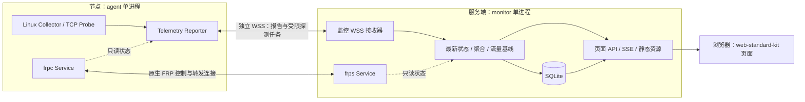

# frp-monitor

基于 FRP 的主机与隧道监控项目：`agent` 复用 frpc，`monitor` 复用 frps，
`web` 基于本仓库的 `web-standard-kit`。三个模块均位于本子项目目录。

> 状态：P0 契约与构建已落地，2026-09-26 更新。已有目录结构、协议契约
> （`shared/`）、构建管线（`scripts/`）与参考 fixture（`tests/fixtures/`）；
> 采集器、监控服务、网页和 frpc/frps 生命周期接线尚未实现（P1 起）。
> 下文是整体方案。

本轮需求将原来的“60 秒上报、最新内存快照、公开 HTML”调整为对齐
`monitor-probe/agent` 的监控方案。本 README 为当前规划入口；
`docs/frpc.md`、`docs/frps.md` 保留为历史设计，冲突时以本文为准。

## 1. 推荐架构

保留 Go 和最小补丁 + Overlay 路线，交付两个可执行文件：

| 模块 | 构成与职责 |
|---|---|
| `agent/` | frpc + Go 采集模块：原生内网穿透、Linux 主机指标、TCP 探测、本地 Proxy 状态 |
| `monitor/` | frps + Go 监控模块：FRP 服务、节点认证、接收、存储、API 和实时推送 |
| `web/` | HTML/CSS/原生 JS：总览、节点、趋势和隧道页面，静态资源嵌入 monitor |

发布名建议为 `frp-monitor-agent`、`frp-monitor-server`，分别保留 frpc/frps
原生命令和配置能力，同时显示自身版本与 FRP 基线版本。节点和服务端各一个进程，
网页无需单独的 Node 服务；HTTPS 可由已有反向代理提供。



监控使用独立 HTTPS/WSS，不经自身 FRP 隧道，不修改 FRP wire protocol。
FRP 登录失败时仍可查看主机及故障状态；监控失联时隧道继续转发。
两条连接均由 agent 主动发起，不要求节点开放入站端口。

监控挂在进程生命周期，不实现为普通 frpc Proxy 插件：后者面向单个 Proxy 连接，
不适合“无 Proxy 也采集、每进程仅一个实例”。FRP 原生监控可提供连接与隧道线索，
无法代替客户端 CPU、内存和磁盘采集。
依据：[FRP 监控说明](https://gofrp.org/en/docs/features/common/monitor/)、
[客户端插件接口](https://github.com/fatedier/frp/blob/4a23aa181c1d7e28eecaa8216024ed753b9d27c8/pkg/plugin/client/plugin.go)。

## 2. 固定参考与范围

| 来源 | 固定版本 / Commit | 用途 |
|---|---|---|
| fatedier/frp | `v0.71.0` / `4a23aa181c1d7e28eecaa8216024ed753b9d27c8` | 运行核心，机器可读值见 `upstream.lock` |
| monitor-probe/agent | `cebc5383abb5963abeb722877a2d82c1a7aea5c6` | Linux 字段、采集口径、TCP 探测 |
| monitor-probe/monitor | `fb4c4a4ce0b3a665ab7a4bd491d2dd447a78e6bc` | 实时状态、历史聚合和流量累计参考 |
| web-standard-kit | 本仓库 `6d41d588b3537b2d2460d73f999d958fd37eb00d` 中的该目录 | 设计令牌、组件、外壳与交互 |

“数据一样”指 Facts、Metrics、TCP 探测的字段覆盖、单位、有效值算法和计数器语义一致，
再增加 FRP 专属数据。用 Go 实现采集，避免额外 Rust 进程或跨语言 FFI。

不承诺原版 monitor-probe agent/hub 二进制直接互通：自有协议会增加版本、会话和质量状态。
价格、到期日、流量额度、分组、通知规则是 monitor 管理数据，不是 agent 自动采集结果。
上游“登录通知”是面板管理员登录，不是 SSH 登录采集。
参考：[monitor 组成](https://github.com/monitor-probe/monitor/blob/fb4c4a4ce0b3a665ab7a4bd491d2dd447a78e6bc/README.md)、
[登录通知代码](https://github.com/monitor-probe/monitor/blob/fb4c4a4ce0b3a665ab7a4bd491d2dd447a78e6bc/src/notify.rs)。

## 3. Agent 数据对齐

以下保留上游字段名，便于制作逐字段验收表。权威定义见
[Facts / Metrics 源码](https://github.com/monitor-probe/agent/blob/cebc5383abb5963abeb722877a2d82c1a7aea5c6/src/collect.rs)。

| 数据组 | 字段 | 口径 |
|---|---|---|
| 系统与硬件 | `hostname, os, kernel, arch, virt, cpu_name, cpu_cores, agent_version` | 核数为逻辑处理器数；自身版本和 FRP 版本分开 |
| 地址 | `ipv4, ipv6` | 每族一个本机地址，公网优先；不等于 NAT 出口地址 |
| 容量 | `mem_total, swap_total, disk_total` | 字节；Facts 和周期 Metrics 都包含 |
| CPU 与负载 | `cpu, load` | 整机 CPU 百分比；1/5/15 分钟负载 |
| 内存与交换 | `mem_used, swap_used` | 字节 |
| 磁盘 | `disk_used` | 有效本地文件系统使用量汇总，字节 |
| 网络 | `net_rx, net_tx, net_rx_total, net_tx_total` | B/s 与所计网卡的内核 lifetime 字节计数器 |
| 计数器范围 | `boot_id, iface` | 内核 boot ID 加所计网卡集合摘要；显式接口筛选规则 |
| 系统动态 | `uptime, tcp, udp, procs` | 秒、socket 汇总、进程数；TCP 包括 TIME_WAIT |

直接读 Linux `/proc`、`/sys` 并调用 `statvfs`。首版支持 Linux amd64/arm64，
推荐 systemd 宿主机部署；容器读数标注 namespace 范围，不能声称一定代表宿主机。
算法验收包括：

- CPU 使用累计时间差，iowait 计入 idle、guest 不重复相加；网速除以实际单调时间差。
- 内存 used = MemTotal − MemAvailable；仅当字段缺失时回退到 MemFree + Buffers + Cached。
  MemAvailable 为 0 是有效数据。Swap used = SwapTotal − SwapFree。
- 磁盘块大小 `bs = f_frsize > 0 ? f_frsize : f_bsize`，used =
  `max(f_blocks - f_bfree, 0) × bs`，使用饱和运算，不能减 `f_bavail`；
  挂载去重及伪文件系统/远程文件系统过滤以参考 fixture 验证。上游过滤 overlay，
  未实现容器文件系统回退；受限环境没有有效挂载时需标注采集范围。
- 网卡过滤同时考虑名称与内核拓扑，避免容器、隧道和叠加接口重复统计；
  支持完整接口名显式纳入与排除，排除优先；所计集合变化必须换基线。
- TCP 对齐 IPv4 inuse + tw + IPv6 inuse，UDP 对齐两族 inuse，不能把 TCP 总数标为 established。
- 接口地址与 monitor 观察到的出口地址分开。后者只能使用直连来源或可信代理信息；
  经 FRP 转发后的 peer 不能当作原节点公网地址。

质量扩展：首报无差分基线和读取失败显示未知，不能伪造为 0；上游首个 CPU/网速样本
实际为 0，这项展示差异要明确记录。有效样本算法保持一致，自有协议支持质量标记。

TCP 探测参考
[agent 任务实现](https://github.com/monitor-probe/agent/blob/cebc5383abb5963abeb722877a2d82c1a7aea5c6/src/main.rs)：
`ping.tasks` 每项含 `id, target, interval`，结果为
`ping.result {task_id, latency_ms}`。测量 TCP 握手而非 ICMP，成功为毫秒，失败为
`-1`，DNS 超时为缺样，普通解析错误为失败。参考限制为每节点 64 任务、间隔
5–3600 秒、每地址 900ms、最多尝试三个地址。延迟不含 DNS 及此前地址失败耗时。
界面用“TCP 探测失败率”，不能暗示测得真实 IP 丢包率。

另加 `extensions.frp`：稳定 Client ID、FRP 版本、控制连接状态、Proxy 名称/类型、
本地目标、启用状态、客户端运行状态；monitor 关联服务端注册状态、连接数和隧道流量。
逐磁盘、逐网卡、物理核数、TCP 状态拆分属于增强项，不替代上游汇总值。

## 4. FRP 接入、身份与兼容

Agent 在 `client.Service.Run` 首次登录前启动监控 goroutine，退出时取消并限时回收；
reload 更新配置快照，不重建重复实例。持续诊断首次登录失败时，部署配置须启用上游
支持的持续重试行为。监控开启后，无 Proxy、FRP 未连接均允许报告。

只读适配器从有效配置、Store 合并结果和 StatusExporter 取得客户端数据；
服务端适配器从 Registry/Stats 取快照。原生内部 Go API 不视为稳定 SDK，调用集中在
适配器并锁定 commit；不向网页提供 Dashboard 凭据或直接复用其路由树。

FRP v0.71.0 默认仅在 Dashboard 配置启用时注册内存统计。Monitor 开启后，即使
Dashboard 关闭也要显式启用该 collector；统一入口保证只注册一次，避免重复统计。
此调整不要求公开 Dashboard，也不改变 Prometheus 的开关与路由。
依据：[server/service.go](https://github.com/fatedier/frp/blob/4a23aa181c1d7e28eecaa8216024ed753b9d27c8/server/service.go)、
[统计聚合器](https://github.com/fatedier/frp/blob/4a23aa181c1d7e28eecaa8216024ed753b9d27c8/pkg/metrics/aggregate/server.go)。

参考接入点：[client/service.go](https://github.com/fatedier/frp/blob/4a23aa181c1d7e28eecaa8216024ed753b9d27c8/client/service.go)、
[配置聚合器](https://github.com/fatedier/frp/blob/4a23aa181c1d7e28eecaa8216024ed753b9d27c8/pkg/config/source/aggregator.go)、
[服务端 Registry](https://github.com/fatedier/frp/blob/4a23aa181c1d7e28eecaa8216024ed753b9d27c8/server/registry/registry.go)。

| 身份 | 规则 |
|---|---|
| `agent_id` | 安装时持久化；每节点独立监控凭据，由服务端从凭据确定归属，不信任正文自填 ID |
| FRP 关联键 | `server_id + user + raw_client_id`；不同 user 可有同名 clientID，不能只按 clientID 建表 |
| `session_id + sequence` | 每次监控连接新会话、会话内递增；只接受当前会话，迟到报告和旧连接退出不得覆盖新连接 |
| `boot_id` | 仅标识网络计数器范围，不用它判断 agent 进程重启或去重会话 |

FRP 关联键用于对账而非认证，冲突须显式报告，不自动重新绑定。未设置稳定 clientID
的普通 frpc 只能作为临时连接记录。监控凭据支持轮换/吊销，服务端保存验证摘要；
原生 FRP token/OIDC 与监控凭据分开。

原版 frpc 仍可连接 monitor 的 frps 部分，标为“未安装采集能力”；
增强 agent 与原版 frps 的转发兼容需要回归验证。保持 FRP wire v1/v2、认证、
Proxy/Visitor 生命周期、原 Dashboard/API/Prometheus 的原有行为。

## 5. 协议、调度与状态

建议 WSS + JSON-RPC 2.0，独立 Listener 路径 `/agent/v1/ws`，Authorization 握手认证。
保留 `hello, report, ping.tasks, ping.result` 方法概念；params 定义自有版本、会话、
序号、采集时间、quality 和扩展区。hello 协商 schema/capabilities，不支持版本明确报错。

| 内容 | 建议频率 / 行为 |
|---|---|
| Facts | 每次连接先报，变化时重报 |
| Metrics | 默认每 1 秒采集/上报，可配置 1–3600 秒，对齐参考默认体验 |
| FRP 与明细 | 变化上报、周期兜底；详细数组与快速指标分开调度 |
| TCP 探测 | 根据 monitor 受限任务列表调度 |
| 浏览器 | SSE 按 1 秒合并更新，初次连接/重连取完整快照 |
| 历史 | 每分钟聚合写入；累计流量使用计数器，不积分页面速率 |

采集/发送不占用 FRP 转发 goroutine，慢操作限时、并发有界。保留最新 Metrics，
探测队列有界，任务下发用版本化完整列表；重连先 Facts 再最新状态，失败指数退避加抖动，
认证失败不高频重试，错过的 tick 不集中补跑。

监控心跳与指标新鲜度分开：采样周期可达一小时，不能因没有 Metrics 就认定连接离线。
页面分别展示监控会话、指标新鲜度、FRP 控制连接、各隧道状态。建议指标过期阈值为
`max(10 秒, 3 × 上报间隔)`，以服务端接收时间判断，客户端时间仅用于诊断偏差。

限制帧大小、数组/字符串长度、速率和连接数，拒绝非有限数、负容量和越界值。
Go 端用整数处理累计字节，浏览器 DTO 使用十进制字符串防止 JS 大整数精度丢失。

## 6. 存储、历史和流量

建议 SQLite WAL + 内存最新快照。秒级数据主要在内存处理，窗口聚合批量写盘；
数据库任务经过独立有界队列，不持有 FRP 转发锁。监控初始化、磁盘或查询故障应使
监控降级，不能拖停隧道。

上述隔离针对可处理的采集、网络和数据库错误。扩展 goroutine 设置局部 panic
处理边界并限制资源；同进程仍共享 Go runtime、内存和退出命运，OOM、未恢复 panic
或进程崩溃仍可能中断隧道。若要求进程级故障隔离，需要另选独立进程部署方案。

| 逻辑表 | 内容 |
|---|---|
| `nodes / credentials` | 节点、FRP 关联、独立凭据、公开字段策略 |
| `node_facts / last_seen` | 最新资产与最后接收时间 |
| `metrics_1m` | CPU、负载、资源、网速和连接数的分钟摘要 |
| `traffic_state / traffic_daily` | 流量基线、累计量、日统计 |
| `probe_tasks / probe_results` | 探测配置、窗口延迟、有效样本数和失败数 |
| `frp_snapshots` | 需要保留的隧道状态变化 |

历史建议默认 7 天、可配置。记录样本数和覆盖时间；曲线按窗口聚合、断线留缺口，
不把一分钟最后一帧当成平均值。持久化 last_seen 不能让 monitor 重启后节点自动在线。

流量分成两类独立显示，不能相加：主机网卡流量包含其他业务与协议开销，
FRP 隧道流量有自己的统计口径；分别标注“节点收/发”和“服务端隧道收/发”。

累计参考
[monitor/db.rs](https://github.com/monitor-probe/monitor/blob/fb4c4a4ce0b3a665ab7a4bd491d2dd447a78e6bc/src/db.rs)：
同一计数器范围用累计值差分；首次只建基线，boot ID/网卡集合变化或计数器回退时重建，
不把 lifetime 总量记成今日新增。基线与累计量同事务更新，缺失读数不能以 0 覆盖基线。
短暂断线后同范围增量可恢复，但跨日/月分配无法精确补齐；范围变化则无法补齐旧增量。
按服务端接收时间归属，明确覆盖限制；如开放重置日、统计时区，应持久化配置。
不能声称与运营商账单完全一致。

## 7. Web 设计

基于 [web-standard-kit](../web-standard-kit/README.md) 数据中台外壳，采用
HTML + CSS + 原生 ES Modules，保持 `wsk-` 组件、128 个令牌、`@layer wsk`、
系统/浅色/深色主题、键盘导航和减弱动画。

| 页面 | 内容 |
|---|---|
| 总览 | 节点在线数、正常隧道数、资源摘要、主机收发速率和异常 |
| 节点列表 | 搜索、分组、排序、表格/卡片；CPU、内存、磁盘、网速、探测和更新时间 |
| 节点详情 | 资源趋势、TCP 探测、主机信息、磁盘/网卡及关联隧道 |
| 隧道 | 节点、名称、类型、运行状态、连接数、流量；管理视图可看本地目标 |
| 接入与设置 | 节点凭据、采样间隔、接口筛选、探测任务、历史与公开策略 |

套件没有 API、实时推送和图表，需要新增 api/stream/store/format/views 模块。
首版趋势用 SVG 折线并附数值摘要，后端按窗口降采样。逐项更新数值，不每秒重建全表；
保留筛选、焦点、选择及滚动，新片段使用 `wsk.mount(fragment)`。
移除 `data-demo-submit`，避免演示表单只弹提示却没有真正保存。

实现时复制套件锁定快照到 `web/assets/`，业务样式分开，不运行时跨子项目引用，
不依赖外部 CDN；静态文件嵌入 monitor 随二进制发布。

建议路由与权限：

- `/`、`/api/public/v1/*`、`/events/public`：公开只读、服务端裁剪的摘要 DTO。
- `/admin/`、`/api/admin/v1/*`、`/events/admin`：会话认证后的完整详情与管理。
- `/agent/v1/ws`：节点独立凭据认证的采集通道。

默认公开 DTO 不含本地目标、IP、主机名、精确内核及凭据，不能仅用 CSS 隐藏。
管理端采用服务端会话、安全 Cookie、写操作 CSRF 防护；探测配置限制操作者与目标策略，
不开放任意命令执行。独立 Listener 默认回环，HTTPS 反向代理发布；远程 agent 校验证书。

公共 JSON/SSE、静态资源、历史和管理页是对旧纯 HTML 方案的明确调整。
原 Dashboard/API/metrics 保持独立路由与认证；按新 JS/CSS/SSE 制定 CSP，
不能直接沿用旧页面禁止脚本的策略。节点和 Dashboard 凭据不进入浏览器。

## 8. 目标目录与构建

目标结构如下（`agent/`、`monitor/`、`web/` 内子包随实施阶段落地）：

```text
frp-monitor/
├── README.md
├── .env                       # 本地配置，不提交
├── .env.example
├── upstream.lock
├── agent/
│   ├── service/               # 生命周期、调度、FRP 只读适配器
│   ├── collect/               # Linux Facts / Metrics
│   ├── probe/                 # TCP 探测
│   └── transport/             # WSS、认证、重连
├── monitor/
│   ├── service/               # 生命周期、FRP Registry / Stats 适配器
│   ├── ingest/                # 认证、接收、会话
│   ├── store/                 # SQLite、迁移、聚合、流量
│   ├── api/                   # 公开/管理 DTO、查询、SSE
│   └── auth/                  # 管理会话与凭据
├── web/
│   ├── index.html
│   ├── admin.html
│   ├── assets/                # 套件快照和业务样式
│   └── src/                   # API、stream、charts、views
├── shared/                    # 协议、单位与质量状态
├── patches/                   # 最小上游补丁与 series
├── scripts/                   # 准备、校验、构建、套件同步、打包
├── tests/                     # 脱敏 fixture、协议和集成验收
├── packaging/                 # 服务、安装与发布模板
├── .cache/                    # 上游临时树，ignored
├── data/                      # 开发状态，ignored
└── dist/                      # 发布包，ignored
```

原 `overlay/` 占位目录已迁入 agent/monitor/web，不维护两份业务代码。
构建采用 Overlay：
显式映射到临时上游树的 `extension/frpmonitor/{agent,monitor,shared,web}`，
共享上游 Go module；嵌入代码放到资源父目录，避免 `go:embed` 跨目录使用 `..`。
生命周期入口通过窄接口依赖扩展，扩展不能反向 import 上游 client/server 根包而形成循环。

构建流程：校验 upstream.lock → 获取固定源码 → 应用 patches/series →
映射扩展与资源 → 测试 → 构建两个二进制 → 输出 Linux amd64/arm64 发布包。
补丁集中在命令/Service 生命周期、配置类型/校验、依赖和资源入口。
完整 FRP 源码只在 ignored 临时树，不提交整份源码、嵌套 .git 或 submodule。

本地默认配置统一在根 `.env`；启动/安装工具显式读取并生成权限受限的运行配置，
frpc/frps 本身不会自动读取它。建议使用 `FRP_MONITOR_*`、`FRP_AGENT_*`、`FRP_*`
前缀。真实配置、数据库、凭据及生成物在引入前配置 ignore，只提交脱敏
`.env.example`，不将秘密注入前端。

## 9. 实施阶段与验收

| 阶段 | 交付 | 验收门槛 |
|---|---|---|
| P0：契约与构建 | 目录迁移、字段/协议契约、Overlay 构建、参考 fixture | 固定源码可重复构建；关闭扩展时原生 FRP 基线通过 |
| P1：实时闭环 | Go 采集、WSS、节点凭据、最小 FRP 连接适配器、最新状态与节点页面 | Facts/Metrics 对齐；无 Proxy、FRP 断连、监控断连状态准确 |
| P2：完整采集体验 | TCP 探测、SQLite 历史、累计流量、趋势与恢复 | 探测语义、会话/重启/网卡变化、流量事务与聚合测试通过 |
| P3：FRP 与发布完善 | 隧道对账、公开/管理视图、接入配置、备份与 systemd 发布 | 两架构部署；权限/字段裁剪、故障恢复、UI 与 FRP 回归通过 |

P1 是本地受控演示闭环，P2 才覆盖参考 agent 的全部采集类别；
公开上线须完成 P3 权限、字段裁剪、备份和部署验收。
告警、价格/到期管理、主题市场、远程 Proxy/Visitor CRUD、Shell、自动升级
不纳入采集同等目标，可后续单独规划。

关键验证：

- 同一套 /proc、/sys、statvfs 和时钟 fixture 对照参考算法；实机并行采样须明确时间误差。
- 首样本、内存 available 为 0、读取失败、特殊挂载、接口过滤、计数器回退、进程/主机重启。
- TCP 成功/拒绝/超时、DNS 超时、多地址回退、任务更新、资源限额。
- FRP user 下同名 clientID 不串节点，旧会话迟到不覆盖新会话，令牌轮换能终止旧会话。
- TCP/UDP/HTTP 及实际使用的 STCP 等隧道、新旧二进制组合；监控/数据库/慢浏览器不阻塞转发。
- Monitor 启用时，Dashboard 开启/关闭两种配置均能统计隧道流量，collector 不重复计数。
- 按 100/500 节点、默认每秒报告验证 CPU、内存、写盘和网页开销；这是容量测试档位，
  不是已证明的性能承诺。设置限额，按结果决定聚合与配置降频。
- 公开 API/SSE 无私有字段，管理写操作有鉴权；浅/深主题、窄屏、键盘、实时刷新焦点检查通过。

## 10. 许可证与来源

本子项目与 FRP 使用 Apache-2.0；参考的 monitor-probe/agent 和 monitor 为 MIT。
移植代码、测试或其他受版权保护材料时，保留版权及 MIT 许可并更新
`THIRD_PARTY_NOTICES.md`。本轮仅作设计调研，未复制上游实现代码。
FRP 完整固定来源记录在 `upstream.lock` 与 `THIRD_PARTY_NOTICES.md`。
