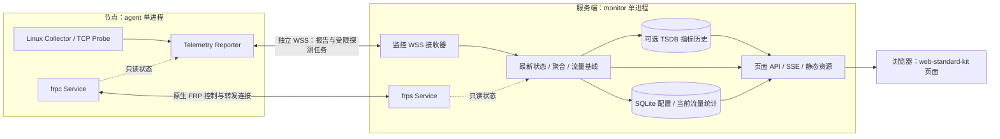

# frp-monitor

基于 FRP 的主机与隧道监控项目：`agent` 复用 frpc，`monitor` 复用 frps，
`web` 基于本仓库的 `web-standard-kit`。三个模块均位于本子项目目录。

> 状态：P4 已实现并通过本地验收。当前代码采用两张 SQLite 业务表、内存实时状态、
> 可选内嵌 VictoriaMetrics 历史，以及 GitHub 管理登录。开发期直接创建新库，
> 不兼容旧配置或数据；本轮尚未部署，实际 GitHub 账号登录需配置 OAuth App。

节点数据结构见第 6 节，当前开发范围与验收要求见第 9 节。
本 README 是当前项目入口；`docs/frpc.md`、`docs/frps.md` 中的旧方案不作为实现依据。

本地入口（在本子项目根目录执行，要求 Python 3.11+、Git、Go 1.26.6+、Node.js/npm 和 OpenSSL）：

```bash
python3 scripts/frp.py prepare
python3 -m unittest discover -s tests -p '*test*.py'
python3 scripts/frp.py test
python3 scripts/frp.py build --native
# 生成私有控制库、节点凭据和回环 TLS 配置；已有目录不会覆盖。
python3 scripts/local.py init
python3 scripts/local.py run
```

默认页面为 `https://127.0.0.1:17401/`。本地生成的证书有效期 30 天，agent 显式信任
该证书；浏览器信任由使用者配置。首次初始化可用 `--http` 选择回环明文开发，
页面为 `http://127.0.0.1:17401/`。两种方式均仅监听回环，不修改系统信任。
Ctrl-C 停止两个进程；配置、数据库与日志保留在 ignored 的 `data/local/`。
macOS 可验证连接和页面，Linux 专属指标显示“—”。需要新安装时使用
`--directory data/p4-demo`，运行时指定同一目录。

初始化创建 `control.sqlite`，预置数字 ID 的本地节点与可信 FRP 绑定；历史默认关闭。
设置 `FRP_MONITOR_HISTORY_DATA_PATH=history` 后，初始化配置会启用主控进程内的 TSDB，
相对目录以本次运行数据目录为基准，保留期默认 7 天。首次初始化加 `--probes` 可开启对本机 FRP
端口的 TCP 建连探测；探测配置保存在控制库的 `settings.probe_json`。

公开页面提供卡片/表格切换、名称搜索和底部实时汇总，不包含地球、可用性或
分组/标签/状态/排序筛选。`/node/{id}` 展示硬件、实时资源、今日及套餐流量和历史曲线。
系统累计、主控时区今日、套餐周期与 FRP 隧道流量分别展示。

两端共用 FRP 的配置入口：通过 `-c` 指定单一 TOML/YAML/JSON 文件，
监控使用 `monitor` / `telemetry` 配置段。环境变量使用 FRP 原生模板显式引用，
启动配置修改后重启；加载规则见 [monitor/README.md](monitor/README.md#配置加载)。

管理页面 `/admin/` **仅通过 github.com 登录**。在主控配置中填写
`githubClientID`、`githubClientSecretFile`、`githubCallbackURL`、`githubAdminUsers`；
客户端密钥使用外部 0600 文件，允许登录的 GitHub 用户名由管理员显式列出。
未配置 GitHub OAuth 时管理功能不可用，公开监控和节点上报仍可运行。
管理页支持节点创建、凭据轮换/撤销、公开策略、费用到期、套餐校准/重置、可信绑定及探测。
配置详情见 [monitor/README.md](monitor/README.md)，部署与备份见
[packaging/README.md](packaging/README.md)。

本地验证与打包：

```bash
# 示例使用 macOS arm64；其他宿主使用实际 GOOS-GOARCH 路径。
python3 tests/smoke.py --agent dist/darwin-arm64/frp-monitor-agent --server dist/darwin-arm64/frp-monitor-server
python3 tests/p4_smoke.py --agent dist/darwin-arm64/frp-monitor-agent --server dist/darwin-arm64/frp-monitor-server
node --test web/tests/*.test.mjs
python3 scripts/frp.py package
```

`.env` 是可选本地配置，默认值与可配置项见 `.env.example`。初次准备和构建需要下载
固定源码、Go 依赖和上游 Dashboard 的 npm 依赖；运行二进制不需要 Node 服务或独立 TSDB
进程。工具链规则见 [scripts/README.md](scripts/README.md)，协议和质量约束见
[shared/README.md](shared/README.md)，测试命令与待验收范围见 [tests/README.md](tests/README.md)。
Linux 采集的 17 组脱敏参考向量位于 `tests/fixtures/collect/`。

`[monitor] databaseFile` 必须指向私有目录内的 SQLite 控制库。历史由
`historyDataPath` 留空关闭历史，非空指定 TSDB 目录并启用；`retentionDays` 默认 7，
开启历史时允许 1–365 天。关闭或损坏历史后端不影响 SQLite 当前流量记账。
控制库不可用时不能继续接受未经可靠授权的节点或管理写入；原生 FRP 转发保持独立。

探测任务通过管理接口写入 SQLite，agent 还需设置 `[telemetry] probeEnabled = true`。
默认仅允许公网单播，访问私网/回环需额外 `probeAllowPrivate = true`。
详情见 [agent/probe/README.md](agent/probe/README.md) 和
[monitor/store/README.md](monitor/store/README.md)。当前套餐账本使用精确整数；TSDB 曲线
使用浮点样本，不用于恢复人工校准量或生成运营商账单。正常退出刷新已接受的尾批，
强制终止可能丢失尚未提交的样本；持久数据不恢复在线状态。

## 1. 推荐架构

保留 Go 和最小补丁 + Overlay 路线，交付两个可执行文件：

| 模块 | 构成与职责 |
|---|---|
| `agent/` | frpc + Go 采集模块：原生内网穿透、Linux 主机指标、TCP 探测、本地 Proxy 状态 |
| `monitor/` | frps + Go 监控模块：FRP 服务、节点认证、接收、存储、API 和实时推送 |
| `web/` | HTML/CSS/原生 JS：总览、节点、趋势和隧道页面，静态资源嵌入 monitor |

发布名建议为 `frp-monitor-agent`、`frp-monitor-server`，分别保留 frpc/frps
原生命令和配置能力，同时显示自身版本与 FRP 基线版本。节点和服务端各一个进程，
网页无需单独的 Node 服务；HTTPS 可由已有反向代理提供。


```mermaid
flowchart LR
    subgraph A[节点：agent 单进程]
        FPC[frpc Service]
        C[Linux Collector / TCP Probe]
        R[Telemetry Reporter]
        C --> R
        FPC -. 只读状态 .-> R
    end
    subgraph M[服务端：monitor 单进程]
        FPS[frps Service]
        I[监控 WSS 接收器]
        S[最新状态 / 聚合 / 流量基线]
        DB[(SQLite 配置 / 当前流量统计)]
        TS[(可选 TSDB 指标历史)]
        API[页面 API / SSE / 静态资源]
        I --> S
        FPS -. 只读状态 .-> S
        S --> DB
        S --> TS
        TS --> API
        S --> API
        DB --> API
    end
    FPC <-->|原生 FRP 控制与转发连接| FPS
    R <-->|独立 WSS：报告与受限探测任务| I
    API --> W[浏览器：web-standard-kit 页面]
```

监控使用独立 HTTPS/WSS，不经自身 FRP 隧道，不修改 FRP wire protocol。
FRP 登录失败时仍可查看主机及故障状态；监控失联时隧道继续转发。
两条连接均由 agent 主动发起，不要求节点开放入站端口。
格式错误的监控配置在原生 `verify` / 加载阶段直接报错；故障隔离保证适用于
配置通过校验后的监控初始化、网络中断和运行故障。

监控挂在进程生命周期，不实现为普通 frpc Proxy 插件：后者面向单个 Proxy 连接，
不适合“无 Proxy 也采集、每进程仅一个实例”。FRP 原生监控可提供连接与隧道线索，
无法代替客户端 CPU、内存和磁盘采集。
依据：[FRP 监控说明](https://gofrp.org/en/docs/features/common/monitor/)、
[客户端插件接口](https://github.com/fatedier/frp/blob/4a23aa181c1d7e28eecaa8216024ed753b9d27c8/pkg/plugin/client/plugin.go)。

## 2. 固定参考与范围

| 来源 | 固定版本 / Commit | 用途 |
|---|---|---|
| fatedier/frp | `v0.71.0` / `4a23aa181c1d7e28eecaa8216024ed753b9d27c8` | 运行核心，机器可读值见 `upstream.lock` |
| monitor-probe/agent | `cebc5383abb5963abeb722877a2d82c1a7aea5c6` | Linux 字段、采集口径、TCP 探测 |
| monitor-probe/monitor | `fb4c4a4ce0b3a665ab7a4bd491d2dd447a78e6bc` | 实时状态、历史聚合和流量累计参考 |
| web-standard-kit | 本仓库 `6d41d588b3537b2d2460d73f999d958fd37eb00d` 中的该目录 | 设计令牌、组件、外壳与交互 |

“数据一样”指 Facts、Metrics、TCP 探测的字段覆盖、单位、有效值算法和计数器语义一致，
再增加 FRP 专属数据。用 Go 实现采集，避免额外 Rust 进程或跨语言 FFI。

不承诺原版 monitor-probe agent/hub 二进制直接互通：自有协议会增加版本、会话和质量状态。
价格、到期日、流量额度、分组、通知规则是 monitor 管理数据，不是 agent 自动采集结果。
上游“登录通知”是面板管理员登录，不是 SSH 登录采集。
参考：[monitor 组成](https://github.com/monitor-probe/monitor/blob/fb4c4a4ce0b3a665ab7a4bd491d2dd447a78e6bc/README.md)、
[登录通知代码](https://github.com/monitor-probe/monitor/blob/fb4c4a4ce0b3a665ab7a4bd491d2dd447a78e6bc/src/notify.rs)。

## 3. Agent 数据对齐

以下保留上游字段名，便于制作逐字段验收表。权威定义见
[Facts / Metrics 源码](https://github.com/monitor-probe/agent/blob/cebc5383abb5963abeb722877a2d82c1a7aea5c6/src/collect.rs)。

| 数据组 | 字段 | 口径 |
|---|---|---|
| 系统与硬件 | `hostname, os, kernel, arch, virt, cpu_name, cpu_cores, agent_version` | 核数为逻辑处理器数；自身版本和 FRP 版本分开 |
| 地址 | `ipv4, ipv6` | 每族一个本机地址，公网优先；不等于 NAT 出口地址 |
| 容量 | `mem_total, swap_total, disk_total` | 字节；Facts 和周期 Metrics 都包含 |
| CPU 与负载 | `cpu, load` | 整机 CPU 百分比；1/5/15 分钟负载 |
| 内存与交换 | `mem_used, swap_used` | 字节 |
| 磁盘 | `disk_used` | 有效本地文件系统使用量汇总，字节 |
| 网络 | `net_rx, net_tx, net_rx_total, net_tx_total` | B/s 与所计网卡的内核 lifetime 字节计数器 |
| 计数器范围 | `boot_id, iface` | 内核 boot ID 加所计网卡集合摘要；显式接口筛选规则 |
| 系统动态 | `uptime, tcp, udp, procs` | 秒、socket 汇总、进程数；TCP 包括 TIME_WAIT |

直接读 Linux `/proc`、`/sys` 并调用 `statvfs`。首版支持 Linux amd64/arm64，
推荐 systemd 宿主机部署；容器读数标注 namespace 范围，不能声称一定代表宿主机。
算法验收包括：

- CPU 使用累计时间差，iowait 计入 idle、guest 不重复相加；网速除以实际单调时间差，
  有效 B/s 按参考实现向下取整。
- 内存 used = MemTotal − MemAvailable；仅当字段缺失时回退到 MemFree + Buffers + Cached。
  MemAvailable 为 0 是有效数据。Swap used = SwapTotal − SwapFree。
- 磁盘块大小 `bs = f_frsize > 0 ? f_frsize : f_bsize`，used =
  `max(f_blocks - f_bfree, 0) × bs`，使用饱和运算，不能减 `f_bavail`；
  挂载去重及伪文件系统/远程文件系统过滤以参考 fixture 验证。上游过滤 overlay，
  未实现容器文件系统回退；受限环境没有有效挂载时需标注采集范围。
- 网卡过滤同时考虑名称与内核拓扑，避免容器、隧道和叠加接口重复统计；
  支持完整接口名显式纳入与排除，排除优先；所计集合变化必须换基线。
- TCP 对齐 IPv4 inuse + tw + IPv6 inuse，UDP 对齐两族 inuse，不能把 TCP 总数标为 established。
- 接口地址与 monitor 观察到的出口地址分开。后者只能使用直连来源或可信代理信息；
  经 FRP 转发后的 peer 不能当作原节点公网地址。

质量扩展：首报无差分基线和读取失败显示未知，不能伪造为 0；上游首个 CPU/网速样本
实际为 0，这项展示差异要明确记录。有效样本算法保持一致，自有协议支持质量标记。

TCP 探测参考
[agent 任务实现](https://github.com/monitor-probe/agent/blob/cebc5383abb5963abeb722877a2d82c1a7aea5c6/src/main.rs)：
`ping.tasks` 每项含 `id, target, interval`，结果为
`ping.result {task_id, latency_ms}`。测量 TCP 握手而非 ICMP，成功为毫秒，失败为
`-1`，DNS 超时为缺样，普通解析错误为失败。参考限制为每节点 64 任务、间隔
5–3600 秒、每地址 900ms、最多尝试三个地址。延迟不含 DNS 及此前地址失败耗时。
界面用“TCP 探测失败率”，不能暗示测得真实 IP 丢包率。

另加 `extensions.frp`：稳定 Client ID、FRP 版本、控制连接状态、Proxy 名称/类型、
本地目标、启用状态、客户端运行状态；monitor 关联服务端注册状态、连接数和隧道流量。
逐磁盘、逐网卡、物理核数、TCP 状态拆分属于增强项，不替代上游汇总值。

## 4. FRP 接入、身份与兼容

Agent 在 `client.Service.Run` 首次登录前启动监控 goroutine，退出时取消并限时回收；
reload 更新配置快照，不重建重复实例。持续诊断首次登录失败时，部署配置须启用上游
支持的持续重试行为。监控开启后，无 Proxy、FRP 未连接均允许报告。

只读适配器从有效配置、Store 合并结果和 StatusExporter 取得客户端数据；
服务端适配器从 Registry/Stats 取快照。原生内部 Go API 不视为稳定 SDK，调用集中在
适配器并锁定 commit；不向网页提供 Dashboard 凭据或直接复用其路由树。

FRP v0.71.0 默认仅在 Dashboard 配置启用时注册内存统计。Monitor 开启后，即使
Dashboard 关闭也要显式启用该 collector；统一入口保证只注册一次，避免重复统计。
此调整不要求公开 Dashboard，也不改变 Prometheus 的开关与路由。
依据：[server/service.go](https://github.com/fatedier/frp/blob/4a23aa181c1d7e28eecaa8216024ed753b9d27c8/server/service.go)、
[统计聚合器](https://github.com/fatedier/frp/blob/4a23aa181c1d7e28eecaa8216024ed753b9d27c8/pkg/metrics/aggregate/server.go)。

参考接入点：[client/service.go](https://github.com/fatedier/frp/blob/4a23aa181c1d7e28eecaa8216024ed753b9d27c8/client/service.go)、
[配置聚合器](https://github.com/fatedier/frp/blob/4a23aa181c1d7e28eecaa8216024ed753b9d27c8/pkg/config/source/aggregator.go)、
[服务端 Registry](https://github.com/fatedier/frp/blob/4a23aa181c1d7e28eecaa8216024ed753b9d27c8/server/registry/registry.go)。

| 身份 | 规则 |
|---|---|
| `node_id` | 主控分配的自增数字 ID；每节点独立监控凭据，由服务端从凭据确定归属，不信任正文自填 ID |
| FRP 关联键 | `server_id + user + raw_client_id`；不同 user 可有同名 clientID，不能只按 clientID 建表 |
| `session_id + sequence` | 每次监控连接新会话、会话内递增；只接受当前会话，迟到报告和旧连接退出不得覆盖新连接 |
| `boot_id` | 仅标识网络计数器范围，不用它判断 agent 进程重启或去重会话 |

FRP 关联键用于对账而非认证。只有管理员预设的 `frp_binding`、agent新鲜报告和服务端
注册表三方唯一一致时才归属；冲突显式报告，不自动重新绑定。未设置稳定 clientID
的普通 frpc 只能作为临时连接记录。监控凭据支持轮换/吊销，服务端保存验证摘要；
原生 FRP token/OIDC 与监控凭据分开。

原版 frpc 连接增强 frps 时保留为独立服务端连接，未绑定agent；
新旧二进制的具体转发回归范围见测试文档。保持 FRP wire v1/v2、认证、
Proxy/Visitor 生命周期、原 Dashboard/API/Prometheus 的原有行为。

## 5. 协议、调度与状态

建议 WSS + JSON-RPC 2.0，独立 Listener 路径 `/agent/v1/ws`，Authorization 握手认证。
保留 `hello, report, ping.tasks, ping.result` 方法概念；params 定义自有版本、会话、
序号、采集时间、quality 和扩展区。hello 协商 schema/capabilities，不支持版本明确报错。

| 内容 | 建议频率 / 行为 |
|---|---|
| Facts | 每次连接先报，变化时重报 |
| Metrics | 默认每 1 秒采集/上报，可配置 1–3600 秒，对齐参考默认体验 |
| FRP 与明细 | 变化上报、周期兜底；详细数组与快速指标分开调度 |
| TCP 探测 | 根据 monitor 受限任务列表调度 |
| 浏览器 | SSE 按 1 秒合并更新，初次连接/重连取完整快照 |
| 历史 | 每分钟聚合写入；累计流量使用计数器，不积分页面速率 |

采集/发送不占用 FRP 转发 goroutine，慢操作限时、并发有界。保留最新 Metrics，
探测队列有界，任务下发用版本化完整列表；重连先 Facts 再最新状态，失败指数退避加抖动，
认证失败不高频重试，错过的 tick 不集中补跑。

监控心跳与指标新鲜度分开：采样周期可达一小时，不能因没有 Metrics 就认定连接离线。
页面分别展示监控会话、指标新鲜度、FRP 控制连接、各隧道状态。建议指标过期阈值为
`max(10 秒, 3 × 上报间隔)`，以服务端接收时间判断，客户端时间仅用于诊断偏差。

限制帧大小、数组/字符串长度、速率和连接数，拒绝非有限数、负容量和越界值。
Go 端用整数处理累计字节，浏览器 DTO 使用十进制字符串防止 JS 大整数精度丢失。

## 6. 存储与节点数据结构

采用 SQLite 保存配置和业务数据、内存保存实时状态、可选 TSDB 保存指标历史。
本节对应当前 P4 实现，整体验收安排见第 9 节。开发期按新结构建库，
不要求兼容或导入现有配置、数据库和历史数据。

### 6.1 存储职责

| 层 | 内容 |
|---|---|
| SQLite | 节点配置、费用与套餐、当前套餐用量、今日流量、计数器恢复基线，以及凭据和探测等业务配置 |
| 内存 | 当前连接/会话、Facts、最新 Metrics、在线与新鲜度、FRP 实时状态、管理登录会话 |
| 可选 TSDB | CPU、内存、磁盘、负载、网络速率及 TCP 探测历史，供节点详情曲线查询 |

TSDB 默认关闭，关闭或后端不可用不应影响 SQLite 记账和实时监控。持久化计数器
只用于恢复累计，不能让节点在中控重启后自动显示在线。私钥等启动凭据继续使用
受保护的外部配置，不保存到节点公开字段。

### 6.2 合并后的 nodes 表

节点核心数据只保存当前值。费用、到期、续费说明、套餐配置、当前周期、今日流量
和基线全部并入 `nodes`，不另建账单、续费记录、套餐版本、每日或周期账本表。节点凭据摘要及 FRP 绑定也保存于此。
管理员直接修改费用、到期和续费说明，不自动扣款或延长到期时间。

```sql
CREATE TABLE nodes (
    -- 基本信息与公开策略
    id                          INTEGER PRIMARY KEY AUTOINCREMENT,
    name                        TEXT NOT NULL,
    public_note                 TEXT NOT NULL DEFAULT '',
    private_note                TEXT NOT NULL DEFAULT '',
    is_public                   INTEGER NOT NULL DEFAULT 1,
    publish_billing             INTEGER NOT NULL DEFAULT 0,
    publish_traffic_plan        INTEGER NOT NULL DEFAULT 1,

    -- 管理员维护的费用、到期和续费说明
    price_minor                 INTEGER,
    currency                    TEXT,
    billing_cycle               TEXT,
    expires_at_ms               INTEGER,
    renewal_note                TEXT NOT NULL DEFAULT '',

    -- 当前套餐配置
    traffic_quota_bytes         TEXT,
    traffic_mode                TEXT NOT NULL DEFAULT 'max',
    traffic_reset_mode          TEXT NOT NULL DEFAULT 'monthly',
    traffic_reset_day           INTEGER NOT NULL DEFAULT 1,
    traffic_reset_timezone      TEXT NOT NULL DEFAULT 'UTC',

    -- 当前套餐周期
    traffic_period_start_at_ms  INTEGER,
    traffic_period_end_at_ms    INTEGER,
    traffic_period_rx_bytes     TEXT NOT NULL DEFAULT '0',
    traffic_period_tx_bytes     TEXT NOT NULL DEFAULT '0',
    traffic_adjustment_bytes    TEXT NOT NULL DEFAULT '0',
    traffic_period_partial      INTEGER NOT NULL DEFAULT 1,

    -- 主控机器系统时区下的今日统计
    traffic_day                 TEXT,
    traffic_today_rx_bytes      TEXT NOT NULL DEFAULT '0',
    traffic_today_tx_bytes      TEXT NOT NULL DEFAULT '0',
    traffic_today_partial       INTEGER NOT NULL DEFAULT 1,

    -- 上次有效系统计数器，首次接入时为空
    counter_boot_id             TEXT,
    counter_interface           TEXT,
    counter_scope               TEXT,
    counter_rx_bytes            TEXT,
    counter_tx_bytes            TEXT,
    counter_received_at_ms      INTEGER,

    -- 管理配置版本与时间
    config_revision             INTEGER NOT NULL DEFAULT 1,
    created_at_ms               INTEGER NOT NULL,
    updated_at_ms               INTEGER NOT NULL,

    -- 当前节点凭据和可信 FRP 绑定
    token_sha256                TEXT NOT NULL UNIQUE,
    frp_binding                 TEXT,          -- NULL 或绑定对象 JSON

    CHECK (price_minor IS NULL OR price_minor >= 0),
    CHECK (traffic_mode IN ('max', 'total', 'rx', 'tx')),
    CHECK (traffic_reset_mode IN ('monthly', 'manual')),
    CHECK (traffic_reset_day BETWEEN 1 AND 31)
);
```

实际建库约束与唯一索引见 [monitor/control/schema.sql](monitor/control/schema.sql)。
另一张表只保存一份探测文档：

```sql
CREATE TABLE settings (
    id         INTEGER PRIMARY KEY CHECK (id = 1),
    probe_json TEXT NOT NULL CHECK (json_valid(probe_json)
                                   AND json_type(probe_json) = 'object')
);
```

`probe_json` 为 `{ "version": 1, "nodes": [] }` 形式，更新时递增版本。删除节点时，
同一事务删除其探测配置并在发生变化时递增版本。两张表不保存管理员账户或管理会话。

字段约定：

- `nodes.id` 为 SQLite 自增整数，API 和 URL 使用其十进制字符串，例如 `/node/1`。删除后不复用 ID。
- `token_sha256` 只保存当前节点令牌的 SHA256 小写摘要；轮换立即撤销旧凭据。
  `frp_binding` 保存管理员明确设置的 `{server_id,user,raw_client_id}`，非空绑定不能重复。
- `price_minor` 保存币种最小单位，例如人民币“分”；NULL 表示未设置，0 表示免费。
  `currency` 使用 CNY、USD 等币种码；`billing_cycle` 可填月付、季付、年付、一次性等。
  付费周期与套餐流量周期独立，`expires_at_ms` 为空表示未设置到期时间。
- 流量以字节计，保存为规范十进制 TEXT，应用使用整数运算，API 同样返回十进制字符串。
  系统计数器不得经浮点数转换；只有 `traffic_adjustment_bytes` 允许为负数。
- `traffic_quota_bytes` 为 NULL 表示未设置上限，不计算剩余量和百分比；0 是实际零额度。
  零额度时百分比为空，非零额度允许显示超过 100% 的使用率。
- 时间戳统一为 UTC 毫秒。`traffic_day` 为主控本地日期 `YYYY-MM-DD`，页面标注“今日流量”。
  `traffic_reset_timezone` 独立决定套餐重置时区，默认 UTC。
- `partial=1` 表示统计覆盖不完整，例如周期中途接入、计数器重置或采集缺口；
  原始累计初始化为 0 不代表接入前的用量已知。首次有效采样只建立基线。
- `config_revision` 与 `updated_at_ms` 随管理员修改更新；采样使用
  `counter_received_at_ms`，不因频繁采样增加配置版本。
- `is_public` 控制整个节点；费用和到期默认不公开，套餐默认公开。公开 API 使用
  字段白名单，不直接序列化整行节点数据，私有备注、凭据和计数器内部标识不公开。

### 6.3 套餐用量与手工校准

当前套餐用量使用同一周期内累计 RX/TX 计算：

| 类型 | 原始计费用量 F(RX, TX) |
|---|---|
| Max / `max` | `max(周期累计 RX, 周期累计 TX)` |
| `total` | `周期累计 RX + 周期累计 TX` |
| `rx` | `周期累计 RX` |
| `tx` | `周期累计 TX` |

```text
本周期已用 = F(周期累计 RX, 周期累计 TX) + traffic_adjustment_bytes
管理员填写已用 U 时：traffic_adjustment_bytes = U - F(当前周期累计 RX, TX)
```

管理员可以随时填写非负已用量；只修改校准差额，不改采集到的 RX/TX，不影响今日、
系统累计或 FRP 流量。例如 Max 模式 RX=100、TX=80，改已用为 150，差额为 50；
随后 RX=110、TX=120，显示 170。Max 必须对整个周期累计收发取较大值，不能逐样本
取 max 后相加。单个服务商已用数字无法还原其历史 RX/TX，手工值用于校准显示用量。

套餐设置修改立即应用当前周期。切换计费类型时保留修改前的已用量，重新计算
`traffic_adjustment_bytes = 原已用量 - 新类型 F(RX, TX)`，随后按新类型继续累计。
例如 RX=100、TX=80、Max 已校准为 150，切换 total 后差额为 -30，已用仍为 150；
管理员仍可随时重新校准。设置修改携带 `config_revision`，过期版本返回冲突。

重置仅支持两种方式：

- 每月固定日期：按套餐时区本地零点重置；该日期不存在时取当月最后一天。
  每次从配置日期计算边界，不因某个月取月末而改变后续月份的重置日。
- 管理员手动重置：将当前周期起点设为重置时间；手动模式的结束时间可以为空。

重置时周期 RX/TX 和校准差额归零，保留系统计数器基线及今日统计。每月模式下手动
重置后仍按下一个配置日期自动重置。修改重置日只调整下一次重置时间，不清空当前用量。
跨日覆盖昨日统计，跨周期覆盖上一周期统计，不保留往日、往期或人工修改历史。

### 6.4 四种流量口径

| 名称 | 来源与保存方式 | 边界 |
|---|---|---|
| 系统累计 | 最新有效 Metrics 的网卡累计 RX/TX，实时值在内存；`counter_*` 保存差分基线 | 可能随主机重启、接口或采集范围变化归零 |
| 今日流量 | 有效系统计数器差分，保存到 `nodes.traffic_today_*` | 主控机器系统时区当天零点至次日零点 |
| 套餐周期 | 同一批系统差分保存到 `nodes.traffic_period_*`，按套餐类型加校准差额计算已用 | 套餐重置时间决定，与今日日期独立 |
| FRP 隧道流量 | 原生 FRP 服务端视角的隧道计数，当前保存在内存 | 保留 FRP 本地日与进程重启口径，部分协议在连接关闭时计入 |

四者独立展示，FRP 隧道流量不能再加到系统或套餐流量中。FRP 只展示可信绑定匹配
的节点观测，不能因同名代理归属变化把旧计数转给新节点。网络速率历史不能替代
持久计数器差分，也不能从 TSDB 自动恢复管理员校准后的套餐账本。

### 6.5 累计与持久化

按节点串行处理有效报告，继续校验连接所有权、会话和序号，拒绝重复/迟到样本。
首次采样只建基线；启动标识、接口、scope 变化或计数器回退时重建基线并标记覆盖不足，
不把 lifetime 总量记成今日或套餐新增。无效/缺失计数器不能用零覆盖基线。

同一 SQLite 事务更新基线、今日增量和当前周期增量；失败整体回滚，避免重试重复累计。
使用有界写队列和批量持久化，不在 FRP 转发线程执行数据库操作。跨日或跨套餐边界的
采样增量按接收时间比例分摊，并标记统计不完整；失败保留旧基线，下一有效采样继续累计。
主控日边界按系统
时区日历计算，不将一天固定写成 86400 秒。界面保留统计不完整的标记，不承诺与
服务商计费账单完全一致。

TSDB 写入不参与 SQLite 事务。关闭或后端故障时保留实时页面和当前流量累计；
历史接口区分未启用、无样本与降级。节点离线期间曲线保留缺口，不补零或恢复为在线。

## 7. Web 设计

基于 [web-standard-kit](../web-standard-kit/README.md) 数据中台外壳，采用
HTML + CSS + 原生 ES Modules，保持 `wsk-` 组件、128 个令牌、`@layer wsk`、
系统/浅色/深色主题、键盘导航和减弱动画。

| 页面 | 内容 |
|---|---|
| 总览 | 节点在线数、正常隧道数、资源摘要、主机收发速率和异常 |
| 节点列表 | 名称搜索、表格/卡片；系统摘要、CPU、内存、硬盘、系统累计流量与网速 |
| 节点详情 `/node/{id}` | 硬件摘要、实时资源、主控时区今日流量、套餐用量、资源趋势、TCP探测和FRP核对 |
| 隧道 | 节点、名称、类型、运行状态、连接数、流量；管理视图可看本地目标 |
| 接入与设置 | 节点凭据、采样间隔、接口筛选、探测任务、历史与公开策略 |

套件没有 API、实时推送和图表，需要新增 api/stream/store/format/views 模块。
首版趋势用 SVG 折线并附数值摘要，后端按窗口降采样。逐项更新数值，不每秒重建全表；
保留筛选、焦点、选择及滚动，新片段使用 `wsk.mount(fragment)`。
移除 `data-demo-submit`，避免演示表单只弹提示却没有真正保存。

实现时复制套件锁定快照到 `web/assets/`，业务样式分开，不运行时跨子项目引用，
不依赖外部 CDN；静态文件嵌入 monitor 随二进制发布。

建议路由与权限：

- `/`、`/node/{id}`、`/api/public/v1/*`、`/events/public`：公开只读、服务端裁剪的摘要 DTO。
- `/admin/`、`/api/admin/v1/*`、`/events/admin`：会话认证后的完整详情与管理。
- `/agent/v1/ws`：节点独立凭据认证的采集通道。

公开硬件摘要仅含 OS、架构、虚拟化、CPU 型号/逻辑核数与 agent 版本。
默认公开 DTO 不含本地目标、IP、主机名、精确内核及凭据，不能仅用 CSS 隐藏。
管理端采用GitHub OAuth 登录、服务端会话、安全 Cookie、写操作 CSRF 防护；探测配置限制操作者与目标策略，
不开放任意命令执行。独立 Listener 默认回环，HTTPS 反向代理发布；远程 agent 校验证书。

公共 JSON/SSE、静态资源、历史和管理页使用独立路由和安全头；原 Dashboard/API/metrics
保持自身路由与认证。节点与 Dashboard 凭据不进入公开网页。

## 8. 目录与构建

当前采集、接收、管理和发布代码集中在下列目录。接收/API 保留在 monitor 包内，
SQLite 控制库与可选 TSDB 分别由 control/store 子包负责，不为规划中的功能提前拆包：

```text
frp-monitor/
├── README.md
├── .env                       # 本地配置，不提交
├── .env.example
├── upstream.lock
├── agent/
│   ├── service/               # 生命周期、WSS、认证、调度和重连
│   ├── collect/               # Linux Facts / Metrics
│   └── probe/                 # TCP 探测
├── monitor/
│   ├── service.go             # Listener、节点认证、接收、会话、公开快照
│   ├── admin.go / github.go   # 管理 API、GitHub OAuth、Cookie 和 CSRF
│   ├── nodes.go               # 节点配置、费用和流量 DTO
│   ├── history.go             # 公开历史查询
│   ├── probe_tasks.go         # 探测配置与下发
│   ├── reconcile.go           # FRP 注册表与指标对账
│   ├── control/               # SQLite nodes/settings、当前流量及计数器基线
│   └── store/                 # 可选内嵌 VictoriaMetrics 指标历史
├── web/
│   ├── index.html
│   ├── admin.html
│   ├── assets/                # 套件快照和业务样式
│   └── src/                   # API、stream、charts、views
├── shared/                    # 协议、单位与质量状态
├── patches/                   # 最小上游补丁与 series
├── scripts/                   # 准备、校验、构建、套件同步、打包
├── tests/                     # 脱敏 fixture、协议和集成验收
├── packaging/                 # 服务、安装与发布模板
├── .cache/                    # 上游临时树，ignored
├── data/                      # 开发状态，ignored
└── dist/                      # 发布包，ignored
```

构建采用 Overlay，将项目扩展显式映射到临时上游树的 `extension/frpmonitor/{agent,monitor,shared,web}`，
共享上游 Go module；嵌入代码放到资源父目录，避免 `go:embed` 跨目录使用 `..`。
生命周期入口通过窄接口依赖扩展，扩展不能反向 import 上游 client/server 根包而形成循环。

构建流程：校验 upstream.lock → 获取固定源码 → 应用 patches/series →
映射扩展与资源 → 测试 → 构建两个二进制 → 输出 Linux amd64/arm64 发布包。
补丁集中在命令/Service 生命周期、配置类型/校验、依赖和资源入口。
完整 FRP 源码只在 ignored 临时树，不提交整份源码、嵌套 .git 或 submodule。

本地默认配置统一在根 `.env`；启动/安装工具显式读取并生成权限受限的运行配置，
frpc/frps 本身不会自动读取它。建议使用 `FRP_MONITOR_*`、`FRP_AGENT_*`、`FRP_*`
前缀。真实配置、数据库、凭据及生成物在引入前配置 ignore，只提交脱敏
`.env.example`，不将秘密注入前端。

## 9. 当前开发与验收

P4 已完成本地实现与验收，当前交付范围为：

- 两张 SQLite 表：`nodes` 保存自增 ID、节点凭据/绑定、费用与当前套餐/今日统计；
  `settings` 保存探测文档。直接创建新库，不导入旧配置和历史数据。
- 管理员手动维护费用、到期和续费说明；套餐支持 Max/total/rx/tx、每月固定日期或
  手动重置。修改立即生效，切换计费类型保留当前已用量，原始 RX/TX 不被校准覆盖。
- 管理页面只使用 GitHub OAuth，显式用户名允许列表；会话和 CSRF 状态保存在内存。
- 可选内嵌 VictoriaMetrics，默认关闭。启用后保存 CPU、内存、磁盘、负载、速率及
  TCP 探测历史，不需要独立服务。保留期默认 7 天，可设 1–365 天。
- 实时状态与业务统计继续分离。历史未启用、无数据与后端降级分别显示；
  节点断线和缺样保留缺口，不补零，不从数据库恢复在线状态。

已通过完整 Go 测试、关键包 race、扩展包 vet、41 项 Python 和 36 项 Node 测试。
真实 Darwin 二进制通过历史开启/关闭、重启恢复及原生 FRP wire v1/v2 的 TCP 转发与重连；
浏览器 fixture 检查通过节点卡片、详情、管理表单及窄屏布局。OAuth 使用受控替身验证，
尚未以真实 GitHub 账号验收。配置加载已覆盖 TOML/YAML/JSON 与显式环境变量模板。
Linux amd64/arm64 发布包已构建，包内校验和、SQLite schema 与许可证检查通过。

验收入口为 `scripts/frp.py test`、Python/Node 测试及 `tests/p4_smoke.py`，覆盖自增 ID 不复用、主控本地午夜和 DST、月末/手动重置、Max 整周期累计、
人工校准及切换类型、事务失败后不重复记账、重启恢复、GitHub 允许列表与
state/PKCE/CSRF、公开字段裁剪，以及 TSDB 开关/查询/保留期/故障隔离。

部署前仍需执行 UDP/HTTP/STCP 和新旧二进制矩阵，确保监控、
存储故障及慢浏览器不阻塞转发。Linux 实机采样、systemd 重启与备份恢复、
长时慢盘和持续负载应以本轮产物重新验收。既有部署数据见 [测试部署记录](tests/DEPLOYMENT.md)，
不能替代 P4 验收；100/500 节点是容量测试档位，不是性能承诺。

节点凭据及探测通过管理接口即时更新；主控启动配置和 GitHub 允许列表变化后重启。
Agent 的 telemetry 配置变化也需重启。原生 Proxy reload 会进入只读快照；
`--config_dir` 模式每进程至多启用一个采集实例。
告警、主题市场、远程 Proxy/Visitor CRUD、Shell 和自动升级不在当前开发范围内。

## 10. 许可证与来源

本子项目与 FRP 使用 Apache-2.0；参考的 monitor-probe/agent 和 monitor 为 MIT。
移植代码、测试或其他受版权保护材料时，保留版权及 MIT 许可并更新
`THIRD_PARTY_NOTICES.md`。协议、构建脚本与合成向量为本项目实现；P1 的 Go
采集算法参考固定 monitor-probe 版本移植，保留 `agent/collect/LICENSE.monitor-probe`，
发布包同时附带该 MIT 许可证。网页复制锁定的 web-standard-kit 资源并记录来源。
SQLite 和内嵌 VictoriaMetrics 使用锁定依赖；适用依赖许可证保存在 `monitor/store/licenses/` 并随包发布。
FRP 源码仅获取到 ignored 临时目录用于构建，二进制随包保留适用许可证与第三方声明。
FRP 完整固定来源记录在 `upstream.lock` 与 `THIRD_PARTY_NOTICES.md`。
