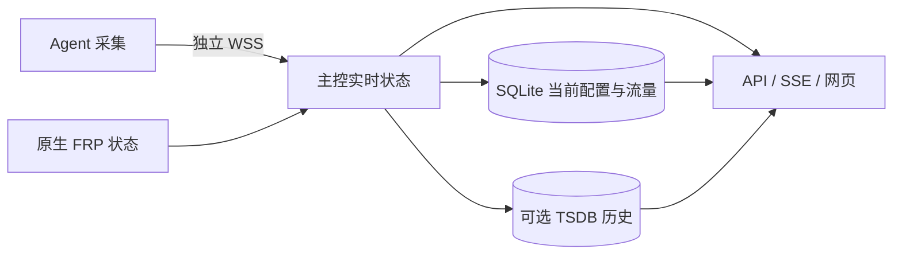

# frp-monitor

基于 FRP 的主机与隧道监控。节点运行 `frp-monitor-agent`（frpc + 采集），主控运行
`frp-monitor-server`（frps + API + 网页），各一个进程。原生穿透、Dashboard 和
wire v1/v2 保留；监控使用独立 HTTPS/WSS，不经自身隧道。

系统采用 SQLite 配置与业务存储、内存实时状态、可选内嵌 VictoriaMetrics 历史和
GitHub 管理登录。现有 v4 控制库会原位升级，保留节点、凭据和当前流量。当前文档描述实现，
未验证的实机部署、真实 GitHub 登录和持续负载范围见 [测试说明](tests/README.md)。

## 快速开始

在本目录执行，需要 Python 3.11+、Git、Go 1.26.6+、Node.js/npm 和 OpenSSL：

```sh
python3 scripts/frp.py build --native
python3 scripts/local.py init
python3 scripts/local.py run
```

默认访问 `https://127.0.0.1:17401/`。初始化在 ignored 的 `data/local/` 生成私有控制库、
数字 ID 节点、独立 FRP/监控凭据和 30 天回环证书；agent 显式信任该证书，不修改系统
信任。浏览器信任由使用者配置。`Ctrl-C` 结束进程，保留配置和数据。

已有目录不覆盖。可用 `--directory data/demo` 新建安装，运行时指定同一目录。
初始化加 `--http` 可选择回环明文开发；加 `--probes` 可授权本机 FRP 端口的 TCP 探测。
macOS 可验证连接和页面，Linux 专属采集字段显示未知。

`.env.example` 列出初始化和构建默认值，可复制为 ignored 的 `.env`。这些工具按
默认值 → `.env` → 进程环境变量读取；生成运行配置后不会继续联动。
例如 `FRP_MONITOR_HISTORY_DATA_PATH=history` 会在运行数据目录下启用历史，留空关闭。

## 配置与管理

两端分别共用 FRP 的单一配置文件，通过 `-c` 加载，支持 TOML/YAML/JSON。
监控使用 `monitor` / `telemetry` 段，运行时环境变量通过 FRP 模板显式引用。
二进制不自动加载 `.env`，启动配置修改后重启。规则和完整示例见
[主控配置](monitor/README.md#配置加载)、[Agent 配置](agent/README.md)。

- 主控 `databaseFile` 指向私有目录中的 SQLite 控制库。
- `historyDataPath` 留空关闭历史，非空即启用内嵌 VictoriaMetrics；`retentionDays`
  默认 7 天，允许 1–365 天，无额外进程或端口。
- `/admin/` 仅通过 github.com 登录。配置 `githubClientID`、`githubClientSecretFile`、
  `githubCallbackURL`、`githubAdminUsers` 四项；允许的用户名直接写在主控配置中。
  Secret 使用外部 0600 文件。未配置 OAuth 时，公开监控和节点上报仍可运行。
- 节点、分组、套餐、公开策略、可信 FRP 绑定和探测通过管理界面即时修改，保存在 SQLite；
  不回写启动配置，不提供本地管理员密码或令牌登录。

## 模块与职责

| 模块 | 职责与详细说明 |
|---|---|
| [agent](agent/README.md) | Linux `/proc`、`/sys` 和文件系统采集，WSS 上报、FRP 客户端状态；[TCP 探测](agent/probe/README.md) |
| [monitor](monitor/README.md) | 节点认证、公开/管理 API、SSE、OAuth 和服务端 FRP 对账 |
| `monitor/control` | SQLite 配置、当前流量账本、基线及串行事务 |
| [monitor/store](monitor/store/README.md) | 可选指标与 TCP 探测历史，有界异步队列和窗口聚合 |
| [shared](shared/README.md) | 帧、质量标记、会话/序号、浏览器整数表示和可信绑定契约 |
| [web](web/README.md) | 嵌入式 HTML/CSS/ES Modules 页面，复用 web-standard-kit，无 CDN 或 Node 运行服务 |
| [scripts](scripts/README.md) | 固定源码构建、本地初始化；[发布与备份](packaging/README.md) |


```mermaid
flowchart LR
    A[Agent 采集] -->|独立 WSS| M[主控实时状态]
    F[原生 FRP 状态] --> M
    M --> C[(SQLite 当前配置与流量)]
    M --> T[(可选 TSDB 历史)]
    M --> W[API / SSE / 网页]
    C --> W
    T --> W
```

原生 FRP 登录失败时，agent 仍可上报；持续诊断需原生 `loginFailExit=false`。
监控断线不应阻塞隧道转发。格式错误在原生 `verify` / 配置加载阶段报错，运行故障
隔离不代表接受非法配置。监控和原生 FRP 使用独立凭据。

可信 FRP 关联键为 `server_id + user + raw_client_id`；只有管理员绑定、节点新鲜报告、
服务端观察三方唯一一致才归属，冲突不自动绑定。实时会话与指标新鲜度分别判断，
缺失或无差分基线显示未知，不能伪造为零。

## 存储与节点数据结构

SQL 的唯一维护来源是 [monitor/control/schema.sql](monitor/control/schema.sql)，
初始化工具与 Go 主控共用此文件。业务库包含 `nodes`、`settings`、`node_groups` 和
`node_group_members` 四张表。分组沿用哪吒的分组表与成员关联表方式，避免在节点中重复保存组名。

| 位置 | 保存内容 |
|---|---|
| `nodes` 基本信息 | `INTEGER PRIMARY KEY AUTOINCREMENT` 数字 ID、名称、公开/私有备注、公开策略 |
| `nodes` 费用 | 最小货币单位价格、币种、账期、到期时间、续费说明，由管理员手工维护 |
| `nodes` 套餐 | 额度、Max/total/rx/tx 类型、每月固定日期或手动重置、套餐时区 |
| `nodes` 当前账本 | 当前周期 RX/TX 与校准差额、主控今日 RX/TX、覆盖不足标记、系统计数器基线 |
| `nodes` 接入 | 当前节点令牌的 SHA256 摘要、可信 FRP 绑定、配置修订号 |
| `settings` | 单行 `probe_json` 探测配置，带递增版本 |
| `node_groups` | 自增数字 ID、唯一分组名称、配置修订号 |
| `node_group_members` | 分组 ID 与节点 ID 联合主键；外键在删除节点或分组时自动清理关联 |
| 内存 | 连接/会话、最新 Facts/Metrics、在线与新鲜度、FRP 实时状态、管理员会话 |
| 可选 TSDB | CPU、内存、磁盘、负载、网速和 TCP 探测等历史曲线 |

API 使用数字 ID 的十进制字符串，例如 `"1"`，删除不复用。时间戳统一 UTC 毫秒；
流量与浏览器大整数使用十进制字符串。价格为非负最小货币单位，流量校准差额可以为负。
不另建账单、续费、套餐版本、每日或周期历史表；只保留当前日和当前周期。

### 节点分组

一个节点可以加入多个分组。在管理页“分组”中创建、重命名、编辑成员或删除分组；
删除分组保留节点，删除节点自动移除其所有组内成员关系。允许空组，最多 128 个分组，
名称区分大小写、唯一、最多 128 个 UTF-8 字节；前后空白去除，控制字符拒绝。
修改或删除提交 `config_revision`，过期版本返回 409，不覆盖他人编辑。

公开首页提供“全部”“未分组”及命名分组切换，可与名称搜索组合，卡片和表格使用同一筛选结果。
同一节点在列表中只出现一次。选择保存在当前浏览器会话中，实时快照和重连后保持；
组不再包含公开节点时回到“全部”。分组名可在公开卡片、表格和详情中查看。
公开数据只在可见节点上附带 `{id,name}`，不公开完整成员目录、空组或仅含隐藏节点的分组。
参考：[哪吒分组说明](https://nezha.wiki/guide/group.html)、
[分组模型](https://github.com/nezhahq/nezha/blob/master/model/server_group.go)和
[成员关联模型](https://github.com/nezhahq/nezha/blob/master/model/server_group_server.go)。

### 四种流量

| 名称 | 口径 |
|---|---|
| 系统累计 | 最新有效网卡 lifetime RX/TX，可能随主机、接口或采集范围变化归零 |
| 今日流量 | 系统计数器差分，按主控机器系统时区的日历零点划日，支持夏令时 |
| 套餐周期 | 同批系统差分，按套餐独立时区和重置规则累计，再加人工校准差额 |
| FRP 隧道流量 | 原生服务端观察，保留 FRP 本地日与进程重启口径；部分协议关闭连接后计入 |

四者独立展示，FRP 流量不再叠加到系统或套餐用量。首次有效采样只建立基线；boot、
接口集合、scope 变化或计数回退时重建。基线、今日和周期增量同事务更新；失败回滚，
下次从旧基线继续。跨日/周期的增量按接收时间比例分摊并标记不完整。

### 套餐校准与重置

```text
F(RX, TX) = max(RX, TX) / RX+TX / RX / TX，按所选套餐类型
本周期已用 = F(周期累计 RX, TX) + 校准差额
管理员设置已用 U：校准差额 = U - F(当前周期累计 RX, TX)
```

Max 对整周期累计收发取较大值。手工校准不改原始 RX/TX、今日或系统累计。
切换类型保留当前已用，再按新类型继续累计：例如 RX=100、TX=80，Max 校准为 150，
改为 total 后差额为 -30，已用仍是 150。修改立即应用，过期 `config_revision` 返回冲突。

每月重置按套餐时区的配置日期零点，日期不存在时取月末，下一月仍使用原配置日期。
手动重置仅清周期 RX/TX 和差额，保留今日与基线；每月模式仍在下一配置日期自动重置。
修改重置日只调整下一边界，不清空已用。未提供套餐时默认无限流量（额度 NULL，显示 ∞），
每月 1 日按套餐时区重置；0 为实际零额度。

周期中途接入、计数器重建或采集缺口保留 `partial` 标记。TSDB 曲线使用浮点采样，
不能恢复人工校准的精确账本；历史关闭或降级时，SQLite 当前记账继续运行。
重启恢复累计，不恢复在线状态；强制终止可能丢失尚未提交的尾批。

## 页面与公开边界

`/` 提供分组切换、名称搜索、卡片/表格和全部公开节点的实时汇总；不包含地球、可用性或标签/状态/排序筛选。
首页卡片的每项资源第一行左侧显示 CPU 核心数、内存容量、硬盘容量或周期流量限额，
右侧显示使用率，第二行显示整宽进度条；浅色主题使用黑色文字、半透明黑色填充、浅灰底轨，
进度条高度为套件默认值的三分之一，使用率不加粗。接收/发送仅显示速率，
流量和费用明细在节点详情页查看。
`/node/{id}` 顶部展示紧凑硬件摘要，详情区展示 CPU、内存、硬盘、网络速率与负载曲线，
卡片标题显示实时值；网络页展示 TCP 探测，流量账目、费用和 FRP 核对在下方展开查看。
`/admin/` 采用横向导航、整宽节点表格和弹窗编辑，管理节点、凭据轮换/撤销、费用到期、
套餐校准/重置、可信绑定及探测，并提供独立的分组与成员管理。

所有页面在上述布局和信息结构上使用 `web-standard-kit` 的组件与主题，包括
动态图表卡片、探测表单、登录和编辑对话框；业务 CSS 只补充布局与监控状态。
套件源码固定在 `6d41d588b3537b2d2460d73f999d958fd37eb00d`，来源与使用方式见
[Web 文档](web/README.md)。

费用和到期默认不公开，套餐默认公开；节点可整体隐藏。公开 API/SSE 使用字段白名单，
排除私有备注、IP、主机名、精确内核、本地目标、内部计数器标识和凭据。
保留系统/浅色/深色主题、键盘导航、减弱动画以及实时更新中的焦点和滚动位置。

TCP 探测不是 ICMP 丢包检测；默认只允许公网单播，私网/回环须由 agent 额外授权。
不提供告警、主题市场、远程命令、自动升级或远程 Proxy/Visitor CRUD。

## 构建与验证

固定源码身份见 [upstream.lock](upstream.lock)。[补丁](patches/README.md) 只修改必要
上游接入点，Overlay 映射 `agent/monitor/shared/web`；源码缓存不提交。运行程序不需要
Node.js、独立 TSDB 或外部网页资源。

```sh
python3 scripts/frp.py test
python3 -m unittest discover -s tests -p '*test*.py'
node --test web/tests/*.test.mjs
python3 tests/smoke.py --agent dist/darwin-arm64/frp-monitor-agent --server dist/darwin-arm64/frp-monitor-server
python3 tests/monitor_smoke.py --agent dist/darwin-arm64/frp-monitor-agent --server dist/darwin-arm64/frp-monitor-server --history
python3 scripts/frp.py package
```

示例二进制路径适用于 Apple Silicon；其他机器使用本机目标路径。`package` 构建
Linux amd64/arm64，并附源码身份、校验和、SQLite schema、初始化/备份工具和许可证。
FRP 互通矩阵、真实采样和故障恢复方法见 [tests/README.md](tests/README.md)。

生成物与依赖放 ignored 的 `.cache/`、`data/`、`dist/`。公开 Git 仅保存脱敏示例；
真实运行配置、密钥、地址与机器采样不提交。来源和许可统一维护于
[THIRD_PARTY_NOTICES.md](THIRD_PARTY_NOTICES.md)，原始许可随发布包保留。
