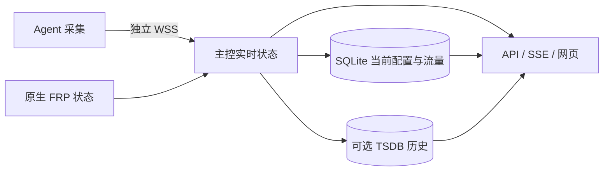

# frp-plus

基于 FRP 的主机与隧道监控。节点运行 `frp-plus-agent`（frpc + 采集），主控运行
`frp-plus-server`（frps + API + 网页），各一个进程。原生穿透、Dashboard 和
wire v1/v2 保留；监控使用独立 HTTPS/WSS，不经自身隧道。

系统采用 SQLite 配置与业务存储、内存实时状态、可选内嵌 VictoriaMetrics 历史和
GitHub 管理登录。开发版控制库为 v8，支持从 v4/v5/v6/v7 升级，保留节点、凭据和当前流量。当前文档描述实现，
未验证的实机部署、真实 GitHub 登录和持续负载范围见 [测试说明](tests/README.md)。

项目原名 `frp-monitor`，目录、发布包与程序名称现统一为 `frp-plus`；两个程序为
`frp-plus-agent` 和 `frp-plus-server`。已有安装升级时需更新启动命令中的程序名；
若同时移动安装或数据目录，还需更新配置及 systemd 单元中的绝对路径。
现有 `FRP_MONITOR_*` 环境变量、`--monitor-version`、`monitor` / `telemetry` 配置段、
内部 `extension/frpmonitor` 包路径、历史指标名、Cookie、浏览器存储键及
`.frp-monitor.json` 构建缓存标记继续沿用，以兼容已有配置、历史和本地缓存。

## 线上部署状态

2026-10-02 主控已升级至提交 `da9600f`，2026-10-03 完成验收。首页工具栏移除搜索框和
排序控件，卡片与表格保持服务端节点顺序，列表底部说明行已移除；顶栏搜索及快捷键保留。
管理入口使用中心镂空的实心齿轮；网络情况右上角显示“2 秒刷新”，卡片宽屏每行 4 个，窄屏按断点自适应。
公共顶栏内层保持 48px，随页面正常滚动；首页卡片/表格切换位于刷新按钮前。
三页页脚统一版权文案和 GitHub 项目链接，短页面仍贴底。
Linux amd64 产物从该提交的隔离源码构建，沿用上次生产 Go/Node/npm 工具链；
Agent 构建产物与上次逐字节一致，本次未更新或重启 Agent，已有独立 FRP 进程保持运行。

主控服务运行正常并保持开机启动。本次无协议、数据库或配置迁移；节点、分组、凭据、
流量账本和历史数据保留，数据库完整性、外键、业务配置摘要及凭据哈希检查通过。
升级前已完成包含运行数据和服务单元的完整冷备，旧发布版本与回退记录保留。

上线验收：10/10 节点在线、采样新鲜、FRP 连接与归属正常，历史存储 ready 且无丢样。
28 项页面资源通过主控本机及公网 HTTPS 的发布清单哈希比对，HTML 以实际 Handler
组合后的响应为基准。公网历史接口首次校验遇到一次 TLS 连接中断，重试后全部通过。
线上浏览器检查首页 1280px、390px 布局：工具栏搜索/排序和列表说明行均已移除；
顶栏搜索、快捷键、清除搜索、重置筛选后的焦点、卡片/表格切换及刷新正常。
宽屏四列、手机单列，无整页或工具栏横向溢出，控制台及本次启动后的服务日志无错误。
GitHub 登录入口配置检查通过；管理私有交互在隔离 fixture 验收，未执行真实账号 OAuth 登录。
78 项前端测试及 Web Go 测试通过，隔离发布源码亦通过生产工具链的 Web Go 测试。
服务器地址、发布与备份路径、校验和及操作记录仅保存在 ignored 的 `.env.serverlist`
和 `data/deploy-da9600f/`，不进入公开 Git。

## 快速开始

在本目录执行，需要 Python 3.11+、Git、Go 1.26.6+、Node.js/npm 和 OpenSSL：

```sh
python3 scripts/frp.py build --native
python3 scripts/local.py init
python3 scripts/local.py run
```

默认访问 `https://127.0.0.1:17401/`。初始化在 ignored 的 `data/local/` 生成私有控制库、
数字 ID 节点、独立 FRP/监控凭据和 30 天回环证书；agent 显式信任该证书，不修改系统
信任。浏览器信任由使用者配置。`Ctrl-C` 结束进程，保留配置和数据。

已有目录不覆盖。可用 `--directory data/demo` 新建安装，运行时指定同一目录。
初始化加 `--http` 可选择回环明文开发；加 `--probes` 可授权本机 FRP 端口的 TCP 探测。
macOS 可验证连接和页面，Linux 专属采集字段显示未知。

`.env.example` 列出初始化和构建默认值，可复制为 ignored 的 `.env`。这些工具按
默认值 → `.env` → 进程环境变量读取；生成运行配置后不会继续联动。
例如 `FRP_MONITOR_HISTORY_DATA_PATH=history` 会在运行数据目录下启用历史，留空关闭。

## 配置与管理

两端分别共用 FRP 的单一配置文件，通过 `-c` 加载，支持 TOML/YAML/JSON。
监控使用 `monitor` / `telemetry` 段，运行时环境变量通过 FRP 模板显式引用。
二进制不自动加载 `.env`，启动配置修改后重启。规则和完整示例见
[主控配置](monitor/README.md#配置加载)、[Agent 配置](agent/README.md)。

- 主控 `databaseFile` 指向私有目录中的 SQLite 控制库。
- `historyDataPath` 留空关闭历史，非空即启用内嵌 VictoriaMetrics；`retentionDays`
  默认 7 天，允许 1–365 天，无额外进程或端口。
- `/admin/` 仅通过 github.com 登录。配置 `githubClientID`、`githubClientSecretFile`、
  `githubCallbackURL`、`githubAdminUsers` 四项；允许的用户名直接写在主控配置中。
  Secret 使用外部 0600 文件。未配置 OAuth 时，公开监控和节点上报仍可运行。
- 节点、分组、套餐、公开策略、可信 FRP 绑定和探测通过管理界面即时修改，保存在 SQLite；
  不回写启动配置，不提供本地管理员密码或令牌登录。

公开首页采用紧凑节点卡片，表格入口切换为横向列表；状态、近期到期、分组和名称搜索可以
组合使用。节点详情先展示当前资源与历史趋势，再查看系统、运行状态、流量套餐和公开备注。
进度条保持单色，浅色与深色主题沿用同一套控件与数据口径。

管理页默认进入侧栏工作台，汇总全部私有节点的在线、离线、等待接入、到期和 FRP 核对
情况，提供到期日历及需要关注的节点入口。节点、分组、TCP 探测、FRP 对账与接入信息
在独立页面切换；原有配置保存、版本冲突保护与一次性凭据流程保留。页面直接读取现有
API/SSE，不包含设计预览中的示例节点，也不新增历史账单、告警或远程控制能力。

## FRP 观察详情与原生配置入口

管理页的节点“资源”区域按需读取 Proxy、Visitor、入口、传输和错误详情；FRP 对账页
同时保留原版客户端和仅服务端可见的代理。公开 JSON/SSE 不包含这些新增私有信息。
客户端配置期望、节点观察、服务端实际监听和管理员公布地址分别标注：动态端口以当前
注册结果为准，通配/回环监听不会自动变成公网链接，STCP/SUDP/XTCP 使用 Visitor 访问。
Visitor 的本地监听、远端连接、P2P 和 fallback 分开表示，没有实际连接时保持未知。
错误只传固定错误码、阶段和发生/恢复时间，不透传可能带凭据的原生日志。

详情显示 TCP/KCP/QUIC/WS/WSS、wire v1/v2、TLS、复用及代理加密/压缩。
控制传输标注为启动配置值，不宣称已经观察到每次握手的实际协商结果。
现代配置的主文件、include、Store 来源可区分；覆盖关系明确显示。旧 INI 来源不能
可靠区分时显示未知。详情中的修订摘要仅用于观察有效对象及 `start` 筛选的变化，
**不作为完整原始配置的并发写入版本**。

“配置管理 · 原生维护说明”保留原生文件维护入口：文件/include 由节点本机维护，先执行
`frp-plus-agent verify -c <配置文件>`；Store 通过已启用的原生 frpc Dashboard/API 维护。
同名 Store 项禁用或删除可能重新启用文件定义，应先检查来源。frpc reload 只能重载
其支持的对象，不替换 serverAddr、认证、TLS、telemetry、Store 路径等全部启动配置；
frps 的监听及 monitor 配置修改需要重启。显式启用 Store 托管后的远程操作见下文；
文件维护入口不会把文件内容自动转成可写的托管对象。

可在主控原生配置中显式公布访问入口（重启生效，以下均为文档占位值）：

```toml
[monitor.nativeAccess]
serverDashboardURL = "https://frps-admin.example.invalid/"

[monitor.nativeAccess.clientDashboardURLs]
"1" = "https://frpc-admin.example.invalid/"

[[monitor.nativeAccess.publishedEndpoints]]
proxyName = "team.web"
user = "team"
clientID = "team.client-example"
url = "https://service.example.invalid/"
```

`clientDashboardURLs` 的键为监控节点数字 ID；公布入口的 `proxyName/user/clientID`
必须与当前服务端观察的完整字段精确匹配，不能用未加用户前缀的 raw client ID 代替。
Dashboard 地址只接受 HTTPS 或字面量回环 HTTP，不允许 URL 内嵌密码、查询参数或片段；
公布入口支持 HTTP/HTTPS 及 TCP/UDP/TCPMUX（后三者仅作为文本）。配置只提供管理页链接，
不会开启监听、代理请求或分发 Dashboard 凭据。回环入口需要本机访问或相应的 SSH 转发。

新详情能力 `frp.detail.v1` 通过握手响应头预告再协商；旧服务端没有预告时，Agent
继续使用旧首报和旧报告。新服务端兼容旧 Agent。详情单独判断新鲜度，失效或超限隐藏
对象列表；主机指标不因详情暂不可用而停止。滚动升级优先更新主控，再更新 Agent。

## 配置事务开发状态

阶段一和配置事务已完成本机验收，**G1/G2 通过；G3 运维与完整发布验收仍在开发**。
具体任务与验收记录见 [todo.md](todo.md)。已接入原生生命周期、独立配置通道、
候选校验与本地事务恢复；管理页面、恢复接管、失败排障与原生进程联合流程通过，
11 类型配置、互通和有限持续负载通过。写管理默认关闭，本机验收不等同生产部署。

- 控制库 v4/v5/v6/v7/v8 首次升级到 v9 前，会在数据库同目录生成 0600 的
  `<数据库文件>.pre-v9-v<旧版本>-<随机值>.sqlite` 一致性备份，包含已提交 WAL。
  备份或同步失败就停止升级；新建库及已有 v9 库不重复生成迁移备份。
- 操作与审计同事务保存；同一节点只允许一个活动操作。`outcome_unknown` 与
  `rollback_failed` 持续占用操作名额，超时、断线和删除节点均不自动抹去审计。
- 原生校验准备包含全部 Proxy/Visitor（包括禁用项），保留未编辑的受支持高级内容；
  来源覆盖、未知字段、重复定义或无法确定的依赖阻止托管。预览不写配置或调用 reload。
- 本地恢复材料使用私有目录、0600 文件和跨进程锁；回退前同时检查 Store 原文及
  文件/includes/启动参数/实际模板依赖。普通重启保留 Service 身份，恢复工具需显式
  更新身份才能拒绝旧命令。秘密引用只在本机解析，原生 Store 与恢复材料仍可能有明文。
- `scripts/ops.py` 的 format 2 保留控制库操作与恢复接管审计；新增 format 3 支持
  工具生成的单 Agent 托管安装，包含 Store、秘密引用和事务恢复材料。两者的范围不同，
  均不能据此宣称完整 includes、外部依赖或跨主机一致备份。

### 隔离节点启用与维护边界

新安装默认关闭配置管理。仅在隔离测试节点可使用
`python3 scripts/local.py init --directory data/managed-demo --manage-config`，或为
`scripts/ops.py agent-init` 增加 `--manage-config`。工具创建 `managed/`（0700）与
`managed/store.json`（0600），将 Store 路径固定在该目录；不修改既有安装。
初始化默认值也可在 `.env` 设置 `FRP_CONFIG_MANAGEMENT_ENABLED=true`，
`--no-manage-config` 可覆盖此设置。生产默认示例保持 false。

已有安装须先备份、处理未完成事务，并在维护窗口明确选择原生文件或 Store 托管。
托管需单个 frpc Service、绝对路径的私有管理根，Store 必须是该根下的直接文件；
不得复用其他服务的身份或恢复材料。`telemetry.configManagement.enabled/root`
与 `store.path` 是启动配置，需要重启。托管时原生 Dashboard 的 Store CRUD、文件写入
与 reload 返回 409；退出托管后才恢复原生写入口。手工修改 Store 不会被原生 reload
自动读入，检测到未知磁盘版本时 Plus 会中止，而不是覆盖它。

`frp-plus-agent verify -c <文件>` 只验证原生文件/include，**不包含 Store 内容**。
Store 候选必须经过完整集合校验；纯本地校验不保证服务端策略接受，也不验证业务可达。

### 托管 Agent 的离线备份与恢复接管

首版 format 3 只接管新版 `agent-init` 生成、带托管安装标记且已启动完成身份初始化的
单 Agent 安装：`agent.toml`、`managed/store.json`、
实际引用的固定 Token/TLS 文件，以及身份、秘密引用、事务日志和旧新 Store 快照。
备份清单记录相对路径、字节摘要、大小和修改时间；归档包含秘密，只能私下保管。
`local.py` 双角色演示和无该标记的旧托管安装不在此范围。includes、环境模板、外部路径、
管理目录或归档清单中的未知内容，以及缺失依赖会明确拒绝。原 format 2
继续用于其原有安装范围，不会忽略托管目录后生成看似完整的备份。

先停止 Agent，再备份；`--offline` 是操作者的停机确认，同时原生 helper 必须取得
与运行实例相同的文件锁。仅传该参数无法绕过正在运行的进程。以下均为占位路径：

```sh
python3 scripts/ops.py backup --directory <安装绝对目录> \
  --output <新建私有归档路径> --offline --agent-binary <当前Agent绝对路径>
python3 scripts/ops.py restore --archive <私有归档路径> \
  --directory <原安装绝对目录> --offline --agent-binary <当前Agent绝对路径>
```

恢复只支持原安装绝对目录，原安装目录与管理根必须仍存在且权限为 0700；保留锁文件，
拒绝跨目录或替换锁目录。全部目录丢失后的灾后重建不在首版范围。
安装恢复材料前先持久化门禁；中途失败保持关闭，可使用同一份已验证归档重试，
不能手工删除门禁或恢复日志来绕过检查。安装成功返回新的 Service 身份、恢复 epoch
与清单摘要；原命令的旧 Service 身份不能继续操作新实例。

恢复分三次核对：

1. 启动 Agent，本地恢复未完成事务并验证实际 Store、启动上下文和 Proxy/Visitor。
   “隧道配置”仍只读；点击“恢复核对”读取当前实例事实，不用上次启动的成功记录冒充当前状态。
2. 管理员核对恢复身份、摘要和原活动操作，勾选后点击“确认接管恢复状态”。主控先核对原日志，
   记录接管审计再发送确认，并保留真实终态；不存在的旧事务以恢复接管事件结束，不伪装成回退成功。
   接管确认本身仍不开放写入，回复丢失时重新核对同一 epoch，不能重新应用旧候选。
3. 再停止 Agent，使用恢复结果中的 epoch 与清单摘要执行离线确认，然后启动并重新读取配置：

```sh
python3 scripts/ops.py restore-confirm --directory <原安装绝对目录> \
  --epoch <恢复epoch> --manifest-digest <恢复清单摘要> \
  --offline --agent-binary <当前Agent绝对路径>
```

离线确认会重新检查上下文、Store、事务状态与已确认的接管记录；重启后再验证一次，
通过才允许写入。管理员接管、磁盘恢复和业务转发是不同事实，仍须实际验证业务协议。
摘要用于检查材料一致性，不是归档来源签名；不要恢复不可信的材料。主控数据库、
TSDB、服务单元和跨机器角色协调不在这个最小 Agent 恢复流程内，阶段三继续扩展。

### 显式迁移文件对象到 Store

`config-migrate` 适用于已开启 telemetry、尚未启用托管的单配置安装。先使用同一配置文件、
工作目录及原生 unsafe-feature 设置生成计划，按原始名称逐个选择 Proxy/Visitor：

```sh
frp-plus-agent config-migrate plan -c /private/frp/frpc.toml \
  --root /private/frp/managed --output /private/frp/migration-review \
  --proxy service-a --visitor service-a-visitor
```

命令只新建 0700 的私有包：`manifest.private.json`、`store.candidate.json`、
逐个原始来源备份及 `MAINTENANCE.txt`，文件均为 0600。包可能包含密钥，不能上传公开仓库。
计划同时列出应从哪个主文件/include 移除哪些对象，并保留原 Store 的存在状态和原始字节。
候选保留现有 Store、禁用项和可校验的高级配置；同名覆盖、未知字段、重复定义、模板和插件
等无法安全迁移的输入直接拒绝，不自动改写既有文件。

在维护窗口停止 frpc，保存整个恢复包，再按清单手工移除选定的原定义；未选定的对象、
include 文件及匹配规则保持原样。将候选安装到计划中的固定 Store（0600、父目录 0700），
只调整 `store.path` 与 `telemetry.configManagement.enabled/root`，随后执行：

```sh
frp-plus-agent config-migrate check -c /private/frp/frpc.toml \
  --bundle /private/frp/migration-review --offline
```

`--offline` 是操作者对停机步骤的确认，工具不检测进程是否停止。成功仅返回
`disk_verified` 与 `runtime_checked=false`：它验证完整配置集合等价、原定义确实移除、
其他来源和 Store 未漂移。启动后仍须在管理页面重新读取来源，核对 Proxy/Visitor 资源及实际
业务转发，才算完成迁移；普通 `verify` 不能代替这个检查。

维护失败时保持停机，按私有清单恢复原来源字节、权限及原 Store 存在状态，再使用原文件模式。
工具不提供任意路径自动恢复，不覆盖其他身份或事务日志。恢复包不记录 UID/GID、ACL、xattr，
这些操作系统身份和权限需管理员保留并核对；摘要用于发现内容变化，不构成签名信任证明。

### 管理操作契约

所有入口位于管理员会话与同源校验保护下的
`/api/admin/v1/nodes/{id}/configuration`；写入还要求 CSRF。盘点只按需读取，不进入公开
节点 API 或 SSE。`operations` 创建请求只携带受限编辑指令、Service 身份、基础摘要、
幂等键和期限；主控先记录草案与脱敏审计，再准备候选。客户端明确确认预览后，才向
`operations/{operation_id}/apply` 提交版本与候选摘要。重连、刷新和主控重启只查询，
不会自动补发 apply。页面丢失预览后需取消并重新校验。

页面只编辑可管理 Store 中的对象；file/include、来源冲突和插件对象保持只读。
新建、编辑、复制、启停、删除和改名都先生成草案、校验及预览，再显式确认应用。
复制从原始 Store 对象取值；改名在同一操作中删除旧名并新增新名，保留已有秘密及
可校验的高级字段，不经浏览器 GET 将原生对象整体写回。

所有 Proxy 的共用字段是 `enabled`、`localIP/localPort`、
`transport.useEncryption/useCompression/bandwidthLimit/bandwidthLimitMode/proxyProtocolVersion`。
所有 Visitor 的共用字段是 `enabled`、`serverUser/serverName`、`bindAddr/bindPort`、
`transport.useEncryption/useCompression`。下表补充类型字段；秘密通过下一段专用流程处理。

| 对象 | 额外可编辑字段 | 已执行的隔离原生业务验收 |
|---|---|---|
| TCP Proxy | `remotePort` | TCP 回显 |
| UDP Proxy | `remotePort` | UDP 数据报回显 |
| HTTP Proxy | `customDomains`、`subdomain`、`locations`、`httpUser/httpPassword`、`hostHeaderRewrite`、`routeByHTTPUser` | 按 Host 路由的 HTTP 响应 |
| HTTPS Proxy | `customDomains`、`subdomain` | SNI 转发至真实 TLS 后端，客户端校验 CA、主机名及响应 |
| TCPMUX Proxy | `customDomains`、`subdomain`、`multiplexer`、`httpUser/httpPassword`、`routeByHTTPUser` | `httpconnect` 的 CONNECT 隧道回显 |
| STCP Proxy | `allowUsers`、`secretKey` | 配对 STCP Visitor 的 TCP 回显 |
| SUDP Proxy | `allowUsers`、`secretKey` | 配对 SUDP Visitor 的数据报回显 |
| XTCP Proxy | `allowUsers`、`secretKey` | 实际注册；未据此验证 NAT 穿透 |
| STCP Visitor | `secretKey` | TCP 回显 |
| SUDP Visitor | `secretKey` | 数据报回显 |
| XTCP Visitor | `secretKey`、`protocol`、`keepTunnelOpen`、`maxRetriesAnHour`、`minRetryInterval`、`fallbackTo/fallbackTimeoutMs` | 确定性的 STCP fallback；同时确认 P2P 失败状态，不宣称 P2P 成功 |

八种 Proxy、三种 Visitor 都已执行 v1/v2 创建、非法候选无副作用、启停及压缩字段修改，
并通过同一整集应用和逐字节回退流程。SUDP 配对对象另验证复制、改名和删除保留秘密。
这不代表表内每个字段组合都已业务测试；域名/端口/引用、传输组合等仍由原生校验约束。
`remotePort=0` 表示申请动态端口；Visitor 的 `bindPort=-1` 仅在原生支持的内部模式使用，
不能解释为已开启网络监听。

| 高级配置 | 当前管理边界 |
|---|---|
| Proxy 加密、压缩、限速及 PROXY 协议 | 上述共用表单开放，仍须通过原生整集校验 |
| HTTP 路由、Host 重写、认证；TCPMUX HTTP 认证 | 按类型开放表中字段；密码只走秘密流程 |
| `loadBalancer.group` | 不开放编辑，已有值在本机保留；`loadBalancer.groupKey` 可走秘密流程 |
| `healthCheck`，含路径、间隔及检查请求头 | 不开放编辑，已有完整配置保留 |
| `annotations`、`metadatas` | 不开放编辑，不把内容送入普通预览 |
| HTTP `requestHeaders`、`responseHeaders` | 不开放编辑，已有值保留，不展示原始请求头秘密 |
| XTCP Proxy/Visitor 的 `natTraversal` | 不开放编辑，已有可校验配置保留 |
| Proxy/Visitor 插件及其参数 | 整个插件对象只读，包含启停、删除、复制和改名 |
| 未知字段、动态或无法完整核对的文件依赖 | 拒绝托管写入；没有任意 JSON 高级编辑入口 |

“保留”指修改其他获准字段时保留已有原生内容，再对完整候选校验；不能用脱敏占位符
替换原值。启动项、`serverAddr/auth/TLS/telemetry/store.path` 和 frps 配置仍需本机
文件维护及重启，页面的 Proxy/Visitor 管理不能改变这些启动事实。

秘密使用保持、替换、清除或既有本机引用。一次 API 操作最多上传两个新秘密，引用可
在同批对象中复用；明文仅用于专用写入请求，不进入主控数据库、审计、预览或浏览器
持久存储。Agent Store、秘密引用库和私有回退快照可能含明文，必须按秘密文件保护。

结果分别记录配置持久化、运行时加载、Proxy 登记/Visitor 本地资源和业务验证。
确认会核对候选 Store 摘要、完整启用集合及 Agent 实际 Proxy/Visitor 管理器；禁用或删除项
须从运行集合消失，Proxy 须达到注册成功阶段，Visitor 须有实际监听或原生内部模式资源。
Proxy 注册状态包含 frps 登记响应，但事务尚未关联主控独立的 frps 观察快照；Visitor 本地
就绪也不证明远端会话、NAT 或业务连通。目前 `business_checked=false`，系统不会自动
访问业务目标；实际业务需要独立的、已授权测试。

页面预览同时显示受控字段差异、影响对象、验证警告、基础修订与候选摘要，并提示连接
可能重建。页面操作默认期限为提交草案后 5 分钟，具体以操作记录为准；未应用预览到期
取消，已应用但资源持续未就绪时由 Agent 本地看门狗进入串行回退。完整配置集合与当前
控制连接核对后，本次明确的 Proxy 注册/本地启动或 Visitor 创建/监听失败会提前回退。
正在等待注册、控制断线、锁忙和健康检查未通过继续按期限核对；Visitor 的远端连接、
P2P 与 fallback 不被当成本地启动失败。错误指本次尝试失败，不表示配置永久无效。
回退的检查、应用及验证各使用独立等待预算（默认每阶段 30 秒）；遇到回调未返回、
来源漂移或材料损坏，不能把期限已到解释成
恢复已完成。控制连接断开、管理员注销均不会取消已经下发的本地事务。

节点离线仍可查看带观察时间的历史结果；旧 confirmed 不能证明当前版本仍相同。
退出管理会话会清除浏览器草稿与秘密，已发出的操作仍按 Agent 本地日志确认或回退。

节点 Token 轮换或删除节点会关闭旧管理连接并拒绝旧凭据；尚未入队的命令不执行，
已下发但没有回复的操作保留 `outcome_unknown` 和审计，不能当作取消成功。轮换后安装新
Token 并恢复连接，再查询原操作；删除节点也不删除其历史或证明 Agent 已回退。管理员
注销只撤销浏览器会话，不会远程终止本地事务。Agent 禁用托管需要本机维护和重启：先处理
未完成操作、确认实际 Store 与运行状态并备份，再关闭开关；不能通过关开关或删日志绕过恢复。

手工回退以当前 Store 内容、存在状态与配置 Context 做 CAS；后续版本不匹配时返回
conflict，保留历史 confirmed，不占用永久恢复名额。这里没有配置历史代际保证：若
Store 字节和 Context 恰好恢复成相同值（ABA），仍允许显式回退。`rollback_failed`
或无法判定的启动恢复保持写入门禁，页面不能宣称“已恢复”。本机处理顺序是：

1. 记录操作 ID、错误码和最近的持久化/运行事实，停止 Agent，保留整个管理根、
   当前 Store、主文件/include、所需环境及凭据材料，保留原始存在态与权限。
2. 核对磁盘空间、权限、来源摘要和旧新快照。仅在确认原上下文后修复故障，再启动并
   查询该操作；`verify` 只检查文件/include，不能证明 Store 已恢复或业务已通。
3. 需要从备份恢复时使用上文离线安装、运行验证、管理员接管和离线确认流程。
   不符合首版最小安装范围、没有可信备份或无法判定应保留版本时保持停机，交管理员
   决策；不提供跳过 CAS 的通用强制覆盖命令，不删除身份、锁文件或事务日志解除门禁。

不能直接用旧二进制打开 v9 控制库；降级需先恢复适用的旧版本备份，并核对节点实际
配置。上述开发没有部署到生产，不改变前文记录的线上版本。

## 模块与职责

| 模块 | 职责与详细说明 |
|---|---|
| [agent](agent/README.md) | Linux `/proc`、`/sys` 和文件系统采集，WSS 上报、FRP 客户端状态；[TCP 探测](agent/probe/README.md) |
| [monitor](monitor/README.md) | 节点认证、公开/管理 API、SSE、OAuth 和服务端 FRP 对账 |
| `monitor/control` | SQLite 配置、当前流量账本、基线及串行事务 |
| [monitor/store](monitor/store/README.md) | 可选指标与 TCP 探测历史，有界异步队列和窗口聚合 |
| [shared](shared/README.md) | 帧、质量标记、会话/序号、浏览器整数表示和可信绑定契约 |
| [web](web/README.md) | 嵌入式 HTML/CSS/ES Modules 页面，复用 web-standard-kit，无 CDN 或 Node 运行服务 |
| [scripts](scripts/README.md) | 固定源码构建、本地初始化；[发布与备份](packaging/README.md) |



原生 FRP 登录失败时，agent 仍可上报；持续诊断需原生 `loginFailExit=false`。
监控断线不应阻塞隧道转发。格式错误在原生 `verify` / 配置加载阶段报错，运行故障
隔离不代表接受非法配置。监控和原生 FRP 使用独立凭据。

可信 FRP 关联键为 `server_id + user + raw_client_id`；只有管理员绑定、节点新鲜报告、
服务端观察三方唯一一致才归属，冲突不自动绑定。实时会话与指标新鲜度分别判断，
缺失或无差分基线显示未知，不能伪造为零。

## 存储与节点数据结构

SQL 的唯一维护来源是 [monitor/control/schema.sql](monitor/control/schema.sql)，
初始化工具与 Go 主控共用此文件。业务库包含 `nodes`、`settings`、`node_groups` 和
`node_group_members` 四张表。分组沿用哪吒的分组表与成员关联表方式，避免在节点中重复保存组名。

| 位置 | 保存内容 |
|---|---|
| `nodes` 基本信息 | `INTEGER PRIMARY KEY AUTOINCREMENT` 数字 ID、名称、公开/私有备注、公开策略 |
| `nodes` 费用 | 最小货币单位价格、币种、账期、到期时间、续费说明，由管理员手工维护 |
| `nodes` 套餐 | 额度、Max/total/rx/tx 类型、每月固定日期或手动重置、套餐时区 |
| `nodes` 当前账本 | 当前周期 RX/TX 与校准差额、主控今日 RX/TX、覆盖不足标记、系统计数器基线 |
| `nodes` 接入 | 当前节点令牌的 SHA256 摘要、可信 FRP 绑定、配置修订号 |
| `settings` | 单行 `probe_json` 探测配置，带递增版本 |
| `node_groups` | 自增数字 ID、唯一分组名称、配置修订号 |
| `node_group_members` | 分组 ID 与节点 ID 联合主键；外键在删除节点或分组时自动清理关联 |
| 内存 | 连接/会话、最新 Facts/Metrics、在线与新鲜度、FRP 实时状态、管理员会话 |
| 可选 TSDB | CPU、内存、磁盘、负载、网速和 TCP 探测等历史曲线 |

API 使用数字 ID 的十进制字符串，例如 `"1"`，删除不复用。时间戳统一 UTC 毫秒；
流量与浏览器大整数使用十进制字符串。价格为非负最小货币单位，流量校准差额可以为负。
不另建账单、续费、套餐版本、每日或周期历史表；只保留当前日和当前周期。

### 节点分组

一个节点可以加入多个分组。在管理页“分组”中创建、重命名、编辑成员或删除分组；
删除分组保留节点，删除节点自动移除其所有组内成员关系。允许空组，最多 128 个分组，
名称区分大小写、唯一、最多 128 个 UTF-8 字节；前后空白去除，控制字符拒绝。
修改或删除提交 `config_revision`，过期版本返回 409，不覆盖他人编辑。

公开首页提供“All”及命名分组切换，可与名称搜索组合，卡片和表格使用同一结果；无分组节点可在“All”中查看。
同一节点在列表中只出现一次。选择保存在当前浏览器会话中，实时快照和重连后保持；
组不再包含公开节点时回到“全部”。分组名可在公开卡片、表格和详情中查看。
公开数据只在可见节点上附带 `{id,name}`，不公开完整成员目录、空组或仅含隐藏节点的分组。
参考：[哪吒分组说明](https://nezha.wiki/guide/group.html)、
[分组模型](https://github.com/nezhahq/nezha/blob/master/model/server_group.go)和
[成员关联模型](https://github.com/nezhahq/nezha/blob/master/model/server_group_server.go)。

### 四种流量

| 名称 | 口径 |
|---|---|
| 系统累计 | 最新有效网卡 lifetime RX/TX，可能随主机、接口变化归零 |
| 今日流量 | 系统计数器差分，按主控机器系统时区的日历零点划日，支持夏令时 |
| 套餐周期 | 同批系统差分，按套餐独立时区和重置规则累计，再加人工校准差额 |
| FRP 隧道流量 | 原生服务端观察，保留 FRP 本地日与进程重启口径；部分协议关闭连接后计入 |

四者独立统计，FRP 流量不叠加到系统或套餐用量，仅在管理页展示。首次有效采样只建立基线；boot、
接口集合变化或计数回退时重建。基线、今日和周期增量同事务更新；失败回滚，
下次从旧基线继续。跨日/周期的增量按接收时间比例分摊并标记不完整。

### 套餐校准与重置

```text
F(RX, TX) = max(RX, TX) / RX+TX / RX / TX，按所选套餐类型
本周期已用 = F(周期累计 RX, TX) + 校准差额
管理员设置已用 U：校准差额 = U - F(当前周期累计 RX, TX)
```

Max 对整周期累计收发取较大值。手工校准不改原始 RX/TX、今日或系统累计。
切换类型保留当前已用，再按新类型继续累计：例如 RX=100、TX=80，Max 校准为 150，
改为 total 后差额为 -30，已用仍是 150。修改立即应用，过期 `config_revision` 返回冲突。

每月重置按套餐时区的配置日期零点，日期不存在时取月末，下一月仍使用原配置日期。
手动重置仅清周期 RX/TX 和差额，保留今日与基线；每月模式仍在下一配置日期自动重置。
修改重置日只调整下一边界，不清空已用。未提供套餐时默认无限流量（额度 NULL，显示 ∞），
每月 1 日按套餐时区重置；0 为实际零额度。

周期中途接入、计数器重建或采集缺口保留 `partial` 标记。TSDB 曲线使用浮点采样，
不能恢复人工校准的精确账本；历史关闭或降级时，SQLite 当前记账继续运行。
重启恢复累计，不恢复在线状态；强制终止可能丢失尚未提交的尾批。

## 页面与公开边界

首页、节点详情和管理页共用 `web/partials/header.html`、`web/partials/footer.html`
与 `web/assets/app.css` 中的公共样式。三个入口 HTML 通过 Go 模板引用公共栏，
管理页的工作台、节点管理、分组管理、TCP 探测、FRP 对账、接入信息分别位于
`web/partials/admin/` 下的 `dashboard.html`、`nodes.html`、`groups.html`、
`probes.html`、`frp.html`、`access.html`；登录、侧栏、创建/凭据/编辑弹窗及节点行模板也独立维护。
服务启动时使用标准库 `html/template` 一次组合并缓存完整页面，不额外请求 HTML 片段，
保留原路由、页内导航、DOM ID、主题首帧恢复与认证清理逻辑。片段文件仅嵌入程序，
不对外提供独立访问路径；模板错误会阻止启动，避免返回残缺页面。
HTML 的 ETag 和部署哈希校验以同一构建经 Web Handler 返回的完整页面为准，
不能再将入口模板源文件直接与 HTTP 响应比较；CSS/JS 仍按原文件校验。

2026-10-02 HTML 拆分本地验收：80 项前端测试及 Web Go 测试通过，新增覆盖模板组合、
缺失/损坏片段、初始认证状态、重复 ID、片段路径 404 和实际响应 ETag。
真实 Handler 输出的三页标签、属性及文本与拆分前一致（忽略格式空白）。浏览器检查
1440、820、390、320px 浅色三页及 320px 深色页面，公共栏对齐且无整页横向溢出；
后台六区切换、分组直达、搜索焦点返回、视图切换、编辑/创建弹窗、登录退出、会话失效清理
与主题跨页保持正常。
验收使用本地合成数据，截图和记录保存在 ignored 的 `.cache/template-audit/`。

顶栏内层最大宽度 1344px、最小高度 48px，随页面滚动离开视口，统一使用 28px pulse 品牌图标；
搜索、主题、管理入口及退出采用 36px 图标按钮，管理入口使用中心镂空的实心齿轮，返回入口保留。首页卡片/表格切换位于正文
工具栏的刷新按钮前，与分组筛选按可用宽度换行，操作区保持右对齐；正文保留原有宽度。
页脚位于正文外，最小高度 48px；随内容滚动，内容较少时由页面 flex 布局贴住窗口底部，
不覆盖正文。三页页脚左侧统一显示“© 2026 FRP Plus · Built with FRP Plus.”，
右侧“KimiChen / frp-plus”链接到 GitHub 项目目录，并在新标签页打开。
公共栏在桌面、中屏和窄屏分别使用 32px、24px、16px 水平留白；窄屏压缩顶栏文字，
页脚版权与仓库链接分行显示，仓库链接保持右对齐。页面预留滚动条空间，
避免长短页面切换时品牌与公共栏左右跳动。套件原始样式、主题存储及业务接口不变。

2026-10-02 公共栏统一验收：80 项前端测试及 Web Go 测试通过；隔离合成数据下检查
1440、820、390、320px 与浅/深主题，三页公共栏对齐且无整页横向溢出。
覆盖多节点、空列表、节点移除、断流重连、管理六个工作区、登录、退出成功/失败及会话失效；
搜索快捷键与焦点返回正常，窄屏编辑窗口操作可见，短页贴底、长页滚动均正常。
以上为本地合成场景验收，线上部署及真实数据检查见“线上部署状态”；未执行真实 GitHub OAuth
登录，fixture 与截图保存在 ignored 目录。

首页和节点页首屏静默加载，默认隐藏顶部提示条；页脚只展示版权与仓库链接。
快照到达后立即渲染，连接异常时才显示顶部警告，重试期间保留警告直到实时连接恢复。
首页直接展示概览，网络情况右上角显示“2 秒刷新”，与节点页共用公开 SSE 刷新周期常量。
卡片宽屏每行 4 个，1200px 及以下每行 3 个、1000px 及以下 2 个、680px 及以下 1 个。
`/` 顶部节点与网络两块总览显示全部、在线、离线、等待接入及累计流量、当前双向速率。
累计量包含离线节点最后有效的系统计数，当前速率仅包含在线且新鲜的有效样本。
状态、未来 7 天到期、分组与名称可组合筛选，卡片和表格按服务端顺序显示同一结果，
汇总保持全部公开节点口径。工具栏展示分组筛选、视图切换和刷新，名称搜索通过顶栏放大镜
或 `⌘ / Ctrl K` 打开弹窗，支持组合筛选、进入详情及键盘操作；列表底部说明行已移除。
首页卡片的每项资源显示名称、使用率及 CPU 核心数、内存容量、存储容量或周期流量限额，
下方为细单色进度条，使用率不加粗。接收/发送仅显示速率，
流量和费用明细在节点详情页查看。
首页卡片、表格及节点页显式显示“在线 / 等待 / 离线”，分组名称独立显示，多个分组以 ` · ` 分隔。
首页“表格”切换采用参考列表主题的紧凑横条：常规内容约 75px 高、8px 间隔和圆角。
CPU、内存、存储、套餐统一为线条图标、使用率、核心数或容量、细彩色进度条；
套餐容量显示额度，悬停显示周期已用/额度。列表不显示 PING/LOSS。
四项资源右侧依次为实时 IN/OUT、系统累计下载/上传、到期时间/运行时长，所有列在同一行。
实时速率以绿色 IN、蓝色 OUT 配合箭头展示，按 B/s 精确换算成十进制 Mbps，两位小数；
累计流量使用云下载/上传图标和“↓总 / ↑总”，按十进制 B、KB、MB、GB 等显示，并提示节点重启可能归零。
到期显示公开日期，悬停保留完整本地时间与倒计时，临近或已到期用提示色；运行时长取最后有效系统采样。
移除原列表中的负载、TCP/UDP、进程数、今日流量、套餐余额、计费和重置明细；详情页仍可查看。
窄屏仅列表内部横向滚动，卡片视图继续自动换行并保留原有字节速率与布局。
两种视图共用筛选、节点顺序与实时更新，保留既有视图偏好。
首页卡片的节点名与状态共用一行，分组位于系统摘要旁。
卡片系统摘要仅显示系统版本和架构，例如 `Debian 12 · x86_64`；去掉 `GNU/Linux`、
括号内的版本代号和虚拟化类型，保留 `LTS`。横向列表使用同一摘要，节点详情保留完整系统信息。
`/node/{id}` 标题旁展示状态徽章，首屏为 CPU、内存、存储和网络当前指标，其后为历史趋势，
底部信息面板按系统配置、运行状态、流量与套餐分区。操作系统合并显示架构与虚拟化环境，内存和存储展示“已用 / 总量”，运行状态
不显示 Agent 版本；今日收发突出显示，套餐详情合并已用 / 额度、类型、使用率与周期日期。
公开费用和备注在面板底部展示。信息面板桌面三列、平板两列、手机单列。
资源趋势展示 CPU、内存、存储、网络速率与负载曲线，卡片标题显示实时值；TCP 探测独立切换。
节点标题右侧与历史范围右侧分别显示“每 2 秒刷新一次”和“30 秒刷新”，替代手动刷新按钮。
首页与节点详情不展示 FRP 连接、隧道、核对状态或隧道流量。
`/admin/` 默认显示侧栏工作台，窄屏导航改为横向滚动。工作台提供状态汇总、需关注列表与到期日历，
节点管理按参考稿使用状态标签和七列表格：节点、分组、状态、IP 地址、套餐、到期、操作。
节点名下合并 ID、系统与隐藏标识；IP 分行展示 IPv4/IPv6，套餐显示占比，到期显示剩余天数。
点击名称或“编辑”进入参考稿样式的编辑窗口，以基本信息、费用与套餐、FRP 绑定三个标签组织配置。
基本信息支持所属分组多选；套餐采用双列表单，校准与重置等放在展开项中；资源详情与接入凭据在底部辅助入口。
跨标签修改统一保存，成功后关闭；取消、关闭和 Esc 放弃未保存内容。分组和设置使用修订号防止覆盖并发修改，
部分保存失败明确提示已完成步骤，重试不会重复已确认的套餐校准。分组与 TCP 探测仍提供独立管理页。

所有页面在上述布局和信息结构上使用 `web-standard-kit` 的组件与主题，包括
动态图表卡片、探测表单、登录和编辑对话框；业务 CSS 只补充布局与监控状态。
套件源码固定在 `6d41d588b3537b2d2460d73f999d958fd37eb00d`，来源与使用方式见
[Web 文档](web/README.md)。

费用和到期默认不公开，套餐默认公开；节点可整体隐藏。公开 API/SSE 使用字段白名单，
排除私有备注、IP、主机名、精确内核、本地目标、内部计数器标识和凭据。
保留系统/浅色/深色主题、键盘导航、减弱动画以及实时更新中的焦点和滚动位置。

TCP 探测不是 ICMP 丢包检测；默认只允许公网单播，私网/回环须由 agent 额外授权。
不提供告警、主题市场、远程命令、自动升级或远程 Proxy/Visitor CRUD。

## 构建与验证

固定源码身份见 [upstream.lock](upstream.lock)。[补丁](patches/README.md) 只修改必要
上游接入点，Overlay 映射 `agent/monitor/shared/web`；源码缓存不提交。运行程序不需要
Node.js、独立 TSDB 或外部网页资源。

```sh
python3 scripts/frp.py test
python3 -m unittest discover -s tests -p '*test*.py'
node --test web/tests/*.test.mjs
python3 tests/smoke.py --agent dist/darwin-arm64/frp-plus-agent --server dist/darwin-arm64/frp-plus-server
python3 tests/monitor_smoke.py --agent dist/darwin-arm64/frp-plus-agent --server dist/darwin-arm64/frp-plus-server --history
python3 scripts/frp.py package
```

示例二进制路径适用于 Apple Silicon；其他机器使用本机目标路径。`package` 构建
Linux amd64/arm64，并附源码身份、校验和、SQLite schema、初始化/备份工具和许可证。
FRP 互通矩阵、真实采样和故障恢复方法见 [tests/README.md](tests/README.md)。

生成物与依赖放 ignored 的 `.cache/`、`data/`、`dist/`。公开 Git 仅保存脱敏示例；
真实运行配置、密钥、地址与机器采样不提交。来源和许可统一维护于
[THIRD_PARTY_NOTICES.md](THIRD_PARTY_NOTICES.md)，原始许可随发布包保留。

公开首页的节点卡片和表格在填写并公开到期时间后显示“N 天后到期”（不足一天按一天计），到期后显示“已到期”；未填写或未公开时隐藏，悬停可查看具体到期时间。

公开首页卡片底部显示到期提示、采样新鲜度和运行时长。运行时长显示为“在线 N 天 M 小时”，不足一天仅显示“在线 M 小时”，不足一小时显示 0 小时；离线节点保留最后上报时长并标为“运行”。该时长来自系统 uptime，不表示监控连续连接时长。
