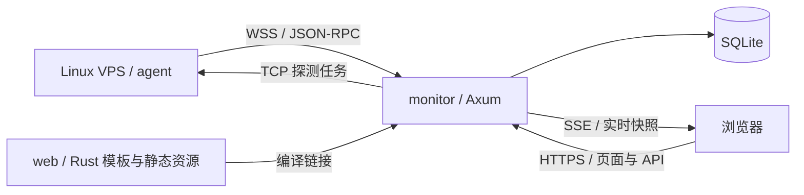

# vps-monitor

Rust VPS 监控子项目规划。主控 `monitor`、采集端 `agent`、网页 `web` 全部放在本目录；采集范围参考 [monitor-probe/agent](https://github.com/monitor-probe/agent)，网页基于本仓库的 [web-standard-kit](../web-standard-kit/README.md)。

**当前状态：设计阶段。** 本轮仅建立本 README 与 `.gitignore`；下述 Cargo workspace、源码目录、配置示例和发布脚本是待实施结构，尚无可运行程序。规划核对日期：2026-09-26。

## 1. 总体选择

采用一个 Cargo workspace、两个可执行程序、两个库：

| 目录 | Cargo 包名 | 类型 | 职责 |
| --- | --- | --- | --- |
| `monitor/` | `vps-monitor` | bin + lib | 节点接入、鉴权、实时状态、历史存储、流量汇总、HTTP API、网页托管 |
| `agent/` | `vps-monitor-agent` | bin + lib | Linux 主机采集、TCP 延迟探测、连接与重连、指标上报 |
| `web/` | `vps-monitor-web` | lib | Rust 页面视图模型、Askama 模板、标准套件样式与浏览器交互资源 |
| `crates/protocol/` | `vps-monitor-protocol` | lib | agent 与 monitor 共享的消息、字段、单位、协议版本和校验规则 |

主控与采集端用 Rust；页面渲染也用 Rust。浏览器仍使用 HTML/CSS，以及实时更新、主题切换、图表所需的少量原生 JavaScript。这里对“语言使用 Rust”的理解是 Rust 承担服务、采集与页面渲染，浏览器资源沿用标准网页技术。

建议技术栈：

- `monitor`：[Tokio](https://docs.rs/tokio/latest/tokio/) + [Axum](https://docs.rs/axum/latest/axum/) + [SQLx](https://docs.rs/sqlx/latest/sqlx/) / SQLite。
- `agent`：Tokio、WebSocket 客户端、rustls；Linux 指标直接读取 `/proc`、`/sys` 与 `statvfs`，便于复现上游口径。
- `web`：[Askama](https://docs.rs/askama/latest/askama/) 编译期模板 + 标准套件 CSS/JS；首版无需 Node、npm 或 WASM 构建。
- `protocol`：Serde / serde_json；不依赖数据库、Axum、模板或操作系统采集实现。
- 日志统一使用 tracing；具体依赖版本在第一轮代码实现时验证并写入 Cargo.lock，不在设计阶段预装依赖。

部署只需要 `vps-monitor` 和 `vps-monitor-agent` 两个二进制。`web` 编译到主控中，不单独启动进程；开发阶段可提供本地静态资源读取模式。



## 2. 标准目录结构

以下为目标结构，按里程碑逐步创建，有实际代码后再增加相应模块，不预先堆积空文件。

```text
vps-monitor/
├── README.md                         # 本子项目唯一主文档：设计、使用、部署、运维
├── Cargo.toml                        # 虚拟 workspace，统一版本、依赖与构建 profile
├── Cargo.lock                        # 两个应用的可复现依赖，纳入 Git
├── rust-toolchain.toml                # 固定已验证的 Rust 工具链与组件
├── .env                              # 本地实际配置，不提交
├── .env.example                      # 脱敏配置模板
├── .gitignore
├── monitor/
│   ├── Cargo.toml
│   ├── src/
│   │   ├── main.rs                   # 配置加载、日志、启动与优雅退出
│   │   ├── lib.rs                    # 可测试的应用装配入口
│   │   ├── config.rs
│   │   ├── state.rs                  # 最新快照、连接注册表与广播通道
│   │   ├── error.rs
│   │   ├── http/
│   │   │   ├── mod.rs                # Axum 路由与中间件装配
│   │   │   ├── auth.rs               # 管理员会话、节点凭据、访问控制
│   │   │   ├── api.rs                # 查询、节点管理与探测任务 API
│   │   │   ├── pages.rs              # 调用 web 渲染页面，装配脱敏视图模型
│   │   │   ├── events.rs             # 浏览器 SSE
│   │   │   └── agent_ws.rs           # agent WebSocket 接入
│   │   ├── services/
│   │   │   ├── nodes.rs              # 节点、连接、离线判定
│   │   │   ├── ingest.rs             # 指标校验、会话隔离与采样接收
│   │   │   ├── traffic.rs            # 计数器基线、流量增量与周期汇总
│   │   │   ├── probes.rs             # 探测任务与结果汇总
│   │   │   └── history.rs            # 分桶、保留期与查询
│   │   └── storage/
│   │       ├── mod.rs                # 数据库连接、迁移与写入队列
│   │       ├── models.rs
│   │       ├── nodes.rs
│   │       ├── metrics.rs
│   │       ├── traffic.rs
│   │       └── probes.rs
│   ├── migrations/                  # SQLx 数据库迁移，仅主控拥有
│   └── tests/                       # API、接入、流量、数据库集成测试
├── agent/
│   ├── Cargo.toml
│   ├── src/
│   │   ├── main.rs
│   │   ├── lib.rs
│   │   ├── config.rs
│   │   ├── runtime.rs               # 采样调度与任务生命周期
│   │   ├── connection.rs            # hello、report、心跳、重连与退避
│   │   ├── collectors/
│   │   │   ├── mod.rs               # 组装 Facts / Metrics
│   │   │   ├── facts.rs             # 系统、CPU、虚拟化与地址
│   │   │   ├── cpu.rs
│   │   │   ├── memory.rs
│   │   │   ├── disk.rs              # 容量；首版不增加磁盘 I/O
│   │   │   ├── network.rs           # 网卡筛选、速率、计数器与 boot_id
│   │   │   └── system.rs            # uptime、TCP/UDP 数量、进程总数
│   │   └── probes/
│   │       ├── mod.rs
│   │       └── tcp.rs               # TCP connect 延迟
│   └── tests/
│       ├── fixtures/                # 脱敏 /proc、/sys 与报文样本
│       ├── collectors.rs
│       └── reconnect.rs
├── web/
│   ├── Cargo.toml
│   ├── src/
│   │   ├── lib.rs                   # 渲染与资源导出；不监听端口
│   │   ├── pages.rs                 # 页面视图模型与 Askama 类型
│   │   ├── filters.rs               # 展示单位、时长、百分比格式化
│   │   └── assets.rs                # 编译期嵌入 CSS/JS/SVG
│   ├── templates/
│   │   ├── base.html
│   │   ├── components/              # 导航、指标卡、状态、表格、对话框
│   │   └── pages/                   # 概览、节点列表/详情、探测、设置、登录
│   ├── static/
│   │   ├── kit/                     # 标准套件 CSS 与经生产适配的组件 JS
│   │   ├── css/app.css              # 监控页面布局与图表样式
│   │   ├── js/app.js                # 页面入口与请求错误展示
│   │   ├── js/live.js               # EventSource、失联状态与快照更新
│   │   ├── js/charts.js             # SVG 趋势图与可访问摘要
│   │   └── icons.svg
│   └── tests/                       # 模板渲染与公开字段检查
├── crates/
│   └── protocol/
│       ├── Cargo.toml
│       ├── src/
│       │   ├── lib.rs
│       │   ├── facts.rs
│       │   ├── metrics.rs
│       │   ├── rpc.rs               # JSON-RPC 请求、通知、响应与错误
│       │   └── probes.rs
│       └── tests/                   # 报文夹具、序列化、版本兼容与单位
├── scripts/
│   ├── check.sh                     # fmt、clippy、test
│   ├── build-release.sh             # 构建两个二进制
│   └── sync-web-kit.sh              # 显式同步基线、校验差异，不自动覆盖适配
├── packaging/
│   ├── systemd/
│   │   ├── vps-monitor.service
│   │   └── vps-monitor-agent.service
│   ├── install-monitor.sh
│   └── install-agent.sh
├── data/                            # 本地 SQLite 与运行数据，ignored
├── logs/                            # 可选本地日志，ignored
└── target/                          # Cargo 构建产物，ignored
```

workspace 成员明确写成 `monitor`、`agent`、`web`、`crates/protocol`。依赖方向为 `monitor → protocol + web`、`agent → protocol`；`web` 只接收页面视图模型，不直接访问 SQLite、不依赖 `monitor`，避免循环依赖。协议库不发展成混合业务逻辑的 `common` 目录。

Rust 集成测试分别放在各 crate 的 `tests/`，保证 Cargo 会实际运行；workspace 根目录只放共享脚本。CI 工作流如需增加，放到 wheels 根目录的 `.github/workflows/`，通过路径过滤只触发本子项目，不能放在子项目内期待 GitHub 自动发现。

## 3. 采集数据对齐

基线锁定 [agent commit `cebc5383abb5963abeb722877a2d82c1a7aea5c6`](https://github.com/monitor-probe/agent/tree/cebc5383abb5963abeb722877a2d82c1a7aea5c6)。`Facts` / `Metrics` 的权威字段定义见该版本 [src/collect.rs](https://github.com/monitor-probe/agent/blob/cebc5383abb5963abeb722877a2d82c1a7aea5c6/src/collect.rs)。

目标是**同样的数据项与统计口径**。首版不承诺能直接替换上游 agent 或连接上游 monitor；协议互通需要另行验证握手、版本、错误处理与任务生命周期。下表是上游现状，后续各节为本项目的建议设计。

### 3.1 静态信息 Facts

每次连接成功时随 `hello` 上报，包括重连；不是只在首次安装时上报。

| 类别 | 字段 | 单位 / 含义 |
| --- | --- | --- |
| 主机与系统 | `hostname`、`os`、`kernel`、`arch`、`virt` | 主机名、发行版、内核、架构、虚拟化类型 |
| CPU | `cpu_name`、`cpu_cores` | 型号、逻辑核心数 |
| 容量 | `mem_total`、`swap_total`、`disk_total` | 字节 B |
| 采集端 | `agent_version` | 版本字符串 |
| 地址 | `ipv4`、`ipv6` | 本机地址，每族一个；公网优先，稳定 IPv6 优先于临时地址 |

公网 NAT 出口地址不能仅从本机接口推出：需要主控结合可信连接来源观察，并与 agent 报告的接口地址分开存储。

### 3.2 实时指标 Metrics

上游默认每 1 秒上报，允许 1–3600 秒。首个采样的 CPU 和网络速率为 0；对齐时要区分这种预热值与真实持续空闲。

| 类别 | 字段 | 单位 / 含义 |
| --- | --- | --- |
| 流量连续区间 | `boot_id` | 内核 boot ID 加所计网卡集合摘要；标识计数器可相减的区间 |
| 网卡选择 | `iface` | 当前网卡选择配置，供展示与编辑预填 |
| 系统运行时长 | `uptime` | 自本次主机开机以来的秒数，不是与主控保持连接的时长 |
| CPU | `cpu` | 整机使用率 0–100%，不乘核心数 |
| 负载 | `load` | 1 / 5 / 15 分钟原始 load，不是百分比 |
| 内存 | `mem_total`、`mem_used` | B；used 口径对齐 `free` |
| Swap | `swap_total`、`swap_used` | B |
| 磁盘容量 | `disk_total`、`disk_used` | B；used 口径对齐 `df` |
| 网络计数器 | `net_rx_total`、`net_tx_total` | 所计网卡的内核累计字节计数；不是账期流量 |
| 网络速率 | `net_rx`、`net_tx` | B/s；UI 若显示 bit/s 必须显式乘 8 并标注单位 |
| 网络数量 | `tcp`、`udp` | TCP / UDP socket 数量，TCP 包括 TIME_WAIT；不是连接详情 |
| 进程 | `procs` | 总数，不采集进程名称、命令行或逐进程资源 |

实现口径要覆盖这些边界：

- 内存已用为 `MemTotal - MemAvailable`，缺少 MemAvailable 时使用 `MemFree + Buffers + Cached` 估计可用量；swap 已用为 `SwapTotal - SwapFree`。
- 磁盘按有效本地挂载汇总并按来源去重，已用字节为 `(f_blocks - f_bfree) × block_size`，其中 block_size 优先取 `f_frsize`，为零时回退到 `f_bsize`。排除伪文件系统、容器 overlay 与远程存储；不提供逐盘详情。解析、筛选和异常回退以锁定版本源码与夹具为准。
- TCP 数量为 `/proc/net/sockstat` 的 `TCP.inuse + TCP.tw` 加 `/proc/net/sockstat6` 的 `TCP6.inuse`；共享的 TIME_WAIT 计数只加一次。UDP 为两文件中的 `UDP.inuse + UDP6.inuse`。不能解释成仅 ESTABLISHED 连接数。
- 不能直接累计所有网卡。复现上游对 loopback、容器、隧道、叠加接口的去重筛选；允许按完整网卡名包含/排除，排除优先。
- `net_rx_total` / `net_tx_total` 原样上报；主控持久化基线并计算周期累计。主机重启导致 boot_id 改变、计数器回退、网卡集合改变时重新立基线；agent 进程重启或连接重建本身不能重置同一 boot_id 的基线。
- 断开后同一计数区间的累计差值可补回流量总量，但缺失期间的秒级历史和精确时间分布无法恢复，不插值伪装为实测。
- 采集失败、字段不支持、采样过期与合法数值 0 应有独立状态；状态可放本项目协议元信息中，保留上游数据字段及其单位。

### 3.3 网络探测

上游另有主控下发的 TCP 探测：`ping.tasks` 包含任务 `id`、`target`、`interval`，agent 返回 `ping.result`，包含 `task_id` 和 `latency_ms`。单位是整数毫秒，连接失败为 `-1`；具体边界以锁定版本 [src/main.rs 中的探测实现](https://github.com/monitor-probe/agent/blob/cebc5383abb5963abeb722877a2d82c1a7aea5c6/src/main.rs#L407-L549) 为准。

- 是 TCP connect 延迟；不能标成 ICMP ping，也不是 HTTP 请求耗时或独立 DNS 探测。
- 最多 64 个任务，任务间隔限制到 5–3600 秒。
- 每次最多尝试 3 个解析地址，各地址握手超时 900ms；成功延迟不含 DNS 解析与此前失败地址的尝试时间。
- 上游 DNS 超时会跳过该次样本，DNS 报错则报告失败；主控应分别统计成功、失败、缺样，缺样不能当成功。
- 主控可由结果计算成功率、TCP 探测失败率与延迟趋势；不能将 TCP 连接失败率宣传为网络包级丢包率。

本次对齐范围不包含 GPU、温度、SMART、磁盘读写 I/O、逐进程详情、ICMP、HTTP 拨测。购买价格、账期、到期时间、供应商、分组标签属于主控配置，在线/离线与历史聚合属于主控计算，不属于 agent 采集字段。

## 4. 通信、数据与配置

### 通信边界

- agent 主动连接主控，使用 WSS + JSON-RPC 风格消息；保留 `hello`、`report`、`ping.tasks`、`ping.result` 的职责。节点凭据放 Authorization 头，不放 URL。
- 首次握手携带本项目协议版本和能力集；采集版本与协议版本分别管理。未知可选字段可忽略，不支持的主版本明确拒绝。
- 用 WebSocket ping/pong 检查连接，基于主控接收时间判断在线状态；离线阈值随上报周期调整。主控重启后节点先处于未知状态，收到有效采样再在线。
- 同一节点的新连接替换旧连接，以连接代次隔离旧消息，避免重复接入和乱序回放污染流量基线。
- 浏览器使用同源页面、REST API 与 SSE。建立订阅时在同一一致性边界内生成带序号的完整快照，随后连续发送同一代次的增量，避免先查询后订阅的空窗；发现缺号、缓冲溢出或代次变化时重新同步。SSE 不承诺永久事件回放。
- 管理员会话、节点上报 token、公开页访问三种权限分开处理。公开页面、REST 与 SSE 共用相同的鉴权规则和白名单 DTO，默认不包含 IP、hostname、凭据和内部错误细节。
- 管理操作使用会话鉴权与 CSRF 防护；JSON API 的错误提供稳定错误码。消息大小、接入频率与任务数量均设上限。

### 存储与流量正确性

SQLite 为首版单实例存储，启用 WAL，通过有界写入队列批量写入；不预设多主节点。建议表按职责划分：

| 表组 | 内容 |
| --- | --- |
| `nodes` / `node_credentials` | 节点属性、启用状态、凭据摘要 |
| `node_facts` | 最新静态信息与更新时间 |
| `metric_samples` / `metric_rollups` | 时间桶样本、历史聚合、样本覆盖率 |
| `traffic_baselines` / `traffic_daily` / `traffic_gaps` | boot_id、累计计数基线、按日汇总、无法按日分配的缺测区间流量 |
| `probe_tasks` / `probe_results` / `probe_rollups` | TCP 任务、结果、延迟与失败统计 |
| `users` / `sessions` | 管理员与会话 |

流量增量和对应新基线在同一事务提交；相同计数器重复上报产生零增量。连接代次属于内存会话状态，持久化流量连续性的依据仍为 `boot_id` 和累计计数器。主控重启不丢失已提交基线。

流量分日默认使用 UTC，页面明确标注统计边界。跨日断线恢复的差值以起止时间、增量单独存入 `traffic_gaps`，计入总累计但不直接计为重连当天的实测流量；日统计展示未分配提示。后续若增加估算分摊，必须与实测桶分开并标记来源。

计数器采用 Rust `u64`，不经浮点计算。SQLite 的有符号 INTEGER 和浏览器 Number 都不能无损覆盖完整 `u64`；累计计数器在数据库与面向浏览器的 JSON 中使用十进制字符串，由 Rust 完成差分。图表只接收经过范围检查的展示值。

建议初始保留策略：1 秒最新数据在内存展示；10 秒历史桶保留 7 天；1 分钟桶保留 30 天；1 小时桶保留 365 天。上述是初始可配置建议，不是性能承诺。CPU/内存等使用均值和峰值，流量使用增量和，探测保留成功/失败/缺样数，避免对累计计数器直接求平均。按 100 节点估算，仅 10 秒桶一天已有 864,000 条节点样本，实施时须压测并根据磁盘预算调整。

### 配置与发布

- 开发默认配置统一在 `vps-monitor/.env`，不再在三个组件内各放一套默认配置；每个进程只解析自己的前缀。
- 配置优先级建议为显式命令行参数 > 进程环境变量 > `.env` > 非敏感默认值；允许用 `--env-file` 指定路径，避免依赖调用时的工作目录。
- `VM_MONITOR_*` 管主控监听地址、数据库位置、保留期；`VM_AGENT_*` 管主控连接地址、节点 token、上报间隔、网卡选择；共用 `RUST_LOG`。
- `.env` 保存进程启动配置；节点名称/分组、探测任务等业务配置入库。网页不直接改写 `.env`，保留期首版只展示生效值；网卡选择通过配置指引更新目标主机 `.env` 并重启 agent，暂不增加远程配置指令。
- 生产时每台机器只安装它需要的程序与 `.env`，配置文件权限 0600。agent 的配置文件属于安装配置，采集运行过程保持无状态。
- `.env.example` 仅放占位符和非敏感默认值；不提交真实域名、IP、密码、证书、密钥或服务器清单。
- 主控首版使用反向代理提供 HTTPS/WSS，默认绑定回环地址；agent 仅对回环开发连接允许明文 WS。
- 首期支持 Linux x86_64 / aarch64，优先产出 musl 二进制；`web` 资源嵌入主控。Rust 解析单元测试可用夹具跨平台运行，实际 `/proc` 采集与安装测试必须在 Linux 验证。
- systemd 模板使用明确的 WorkingDirectory / EnvironmentFile / 数据目录，采集服务从非特权用户开始验证；后续有实际需求再增加 OpenRC 或容器包装。

## 5. 基于 web-standard-kit 的网页规划

设计基线为本仓库 [web-standard-kit/README.md](../web-standard-kit/README.md)，规划时最近一次修改该子项目的提交是 `6d41d588b3537b2d2460d73f999d958fd37eb00d`。

### 页面与交互

| 页面 | 首版内容 |
| --- | --- |
| 概览 | 在线/离线数量、总速率、流量汇总、节点状态卡 |
| 节点列表 | 分组筛选、状态、CPU/内存/磁盘、上下行速率、最近上报时间 |
| 节点详情 | Facts、实时指标、历史趋势、TCP 探测结果 |
| 探测管理 | TCP 目标、任务间隔、节点分配、成功/失败/缺样 |
| 节点与系统设置 | 节点注册、token 轮换、网卡配置指引、生效中的数据保留参数 |
| 登录 / 可选公开页 | 管理登录；仅展示允许公开的节点信息 |

采用标准套件“数据中台参考”的左侧导航与主内容布局，复用 `wsk-` 组件类、128 个设计令牌、浅深主题与跟随系统模式。卡片、表格、状态颜色、对话框、焦点环、减少动画与移动布局沿用同一基线。

页面使用真实 URL，例如 `/nodes`、`/nodes/{id}`、`/probes`。Askama 输出首屏 HTML；浏览器只更新变化的指标，避免每秒替换整页或移动用户正在查看的表格行。图表先使用 SVG 与文字摘要，需要复杂交互后再评估独立图表依赖。

### 复用边界

- 标准套件资源在实施时复制到 `web/static/kit/` 并记录来源提交；构建不从 GitHub/CDN 下载资源，也不在生产环境引用兄弟目录。
- `style.css` 保留 `@layer wsk` 与完整令牌；监控特有布局放 `app.css`。不把本项目业务逻辑反写到标准套件。
- 组件 JS 提取并适配主题、菜单、页签、对话框、提示与挂载能力；不直接照搬整个演示脚本。
- 套件 `applyHash()` 默认视图硬编码为 `kit`，`syncReferenceNav()` 按 hash 导航设置选中状态；本项目移除演示视图路由，SSR 路径导航由页面渲染处理，避免隐藏页面或清除选中态。
- `data-demo-submit` 会阻止真实表单提交并仅弹提示，不能用于登录或设置；实际表单要调用真实处理端点并展示服务端校验结果。
- 套件集合的筛选、排序、分页只针对当前 DOM，默认每页 3 条。生产服务端分页采用 URL 参数与总条数，不能再叠加套件的 DOM 分页造成只排序当前页的假象。
- 局部替换组件后调用保留下来的幂等 `wsk.mount(fragment)`；每秒只改文本值时不触发全页挂载。同步基线脚本必须保留并核对这些适配。
- Askama 使用默认 HTML 转义；主机名、节点标签等不直接作为 HTML 注入。禁用 JS 时仍可查看首屏快照，并提示实时刷新不可用。

## 6. 实施顺序与验收

| 阶段 | 交付 | 验收重点 |
| --- | --- | --- |
| M0：工程骨架 | workspace、四个 crate、配置加载、最小启动与健康检查 | crate 依赖无环；从干净检出可构建；两个程序能分别启动 |
| M1：采集闭环 | Facts / Metrics、节点 token、WebSocket、主控最新状态 | 对照上游夹具及同机实测；CPU/内存/磁盘单位一致；Linux 双架构采集 |
| M2：数据正确性 | SQLite 迁移、流量基线、历史聚合、TCP 任务 | 重复上报、重启、重连、换网卡、计数器回退、DNS 超时、缺样处理 |
| M3：网页 | kit 适配、概览、列表、详情、设置、SSE | 浅/深/系统主题；键盘与窄屏；断连/过期/空态；公开字段白名单 |
| M4：交付 | systemd、安装/升级、备份恢复、发布产物 | 空机安装、重启恢复、迁移与回退说明、容量和保留期压测 |

每个实施阶段使用 `cargo fmt --check`、`cargo clippy --workspace --all-targets -- -D warnings`、`cargo test --workspace`；Linux 专属代码在 Linux CI 运行，不能把 macOS 下跳过采集模块的构建当作采集验证。当前文档阶段不声称这些代码检查已经通过。

告警通知、费用/到期管理、远程命令执行、自动更新、第三方主题、多租户等不自动并入首版；用户当前要求是采集数据对齐与现有网页设计复用。未来新增功能仍分别落在主控服务、明确协议、网页三个边界内。

## 7. 参考与同步约定

- [monitor-probe 组织](https://github.com/monitor-probe)：参考项目入口。
- [monitor 主控](https://github.com/monitor-probe/monitor)：上游采用 Rust / Axum / SQLite，agent 经 WebSocket / JSON-RPC 接入。
- [锁定版本的 agent](https://github.com/monitor-probe/agent/tree/cebc5383abb5963abeb722877a2d82c1a7aea5c6)：字段、计数口径、网卡筛选和探测行为的基线。
- [web-standard-kit](../web-standard-kit/README.md)：本项目页面的视觉与组件基线。

后续升级参考版本先核对字段、单位、默认值和行为差异，再更新夹具与 README 中的基线，不直接追随上游 main。若复制或改写上游实现，按其 MIT 许可保留对应版权与许可声明；仅规划阶段不引入上游源码。
